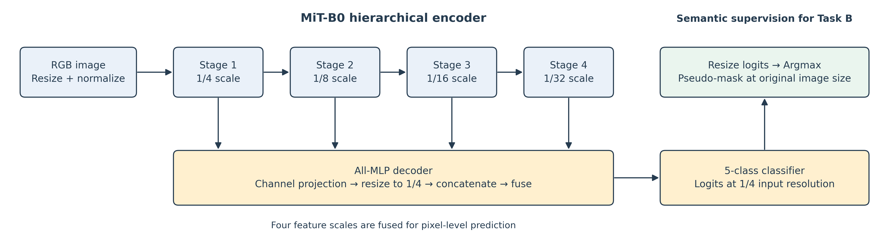
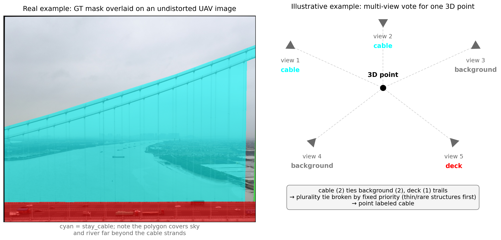
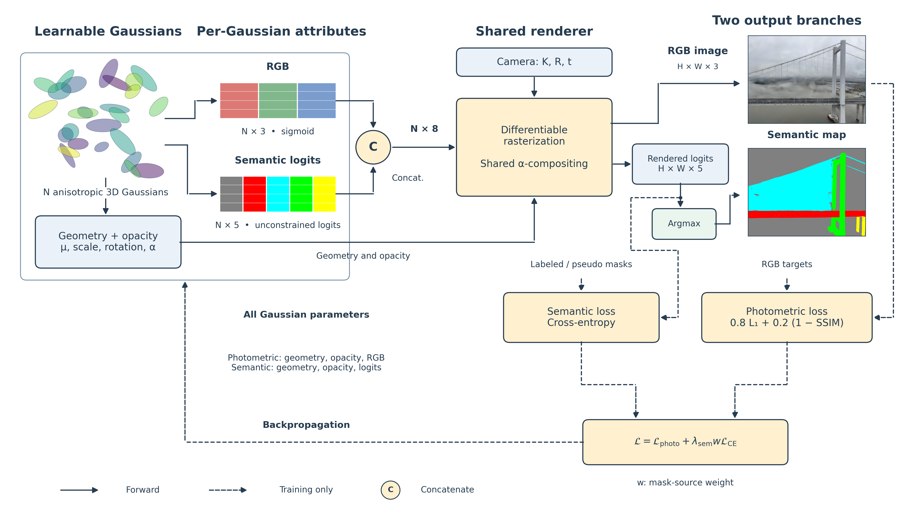
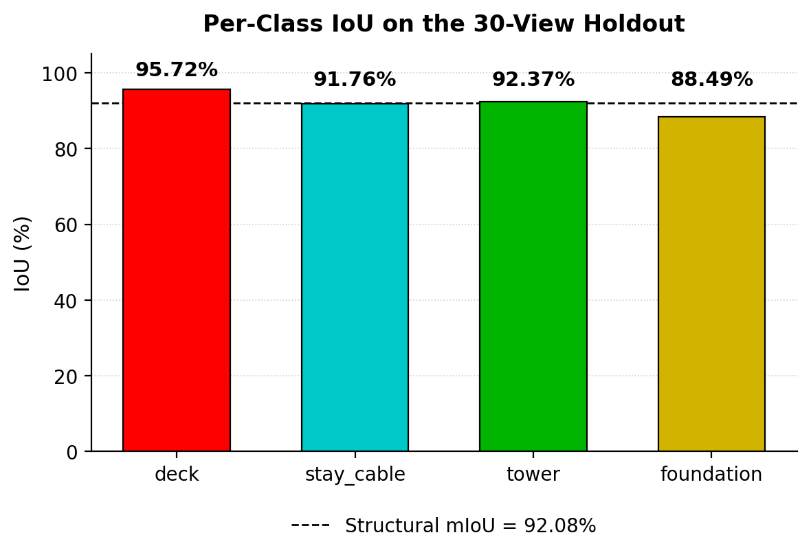
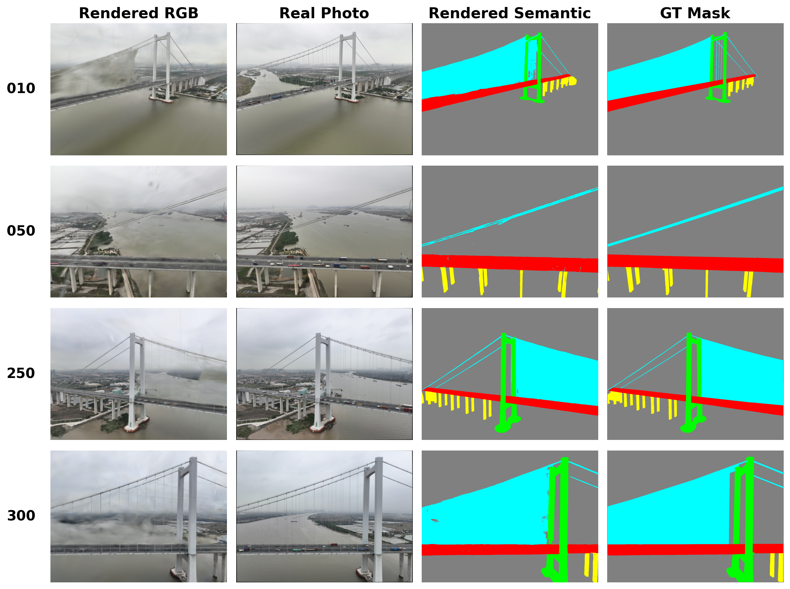
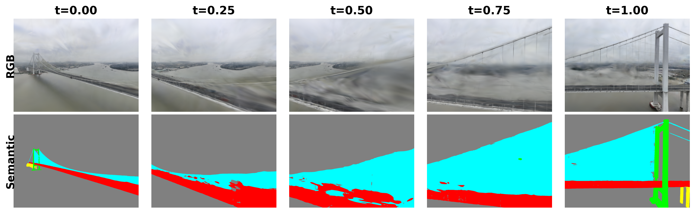
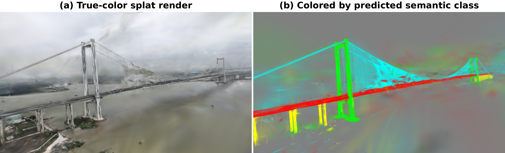
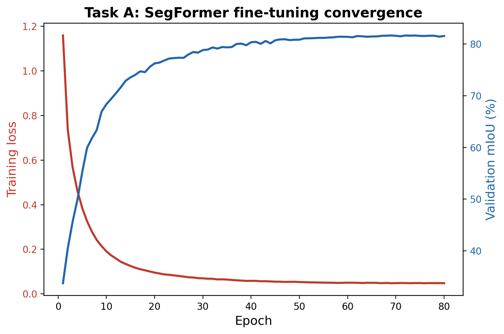
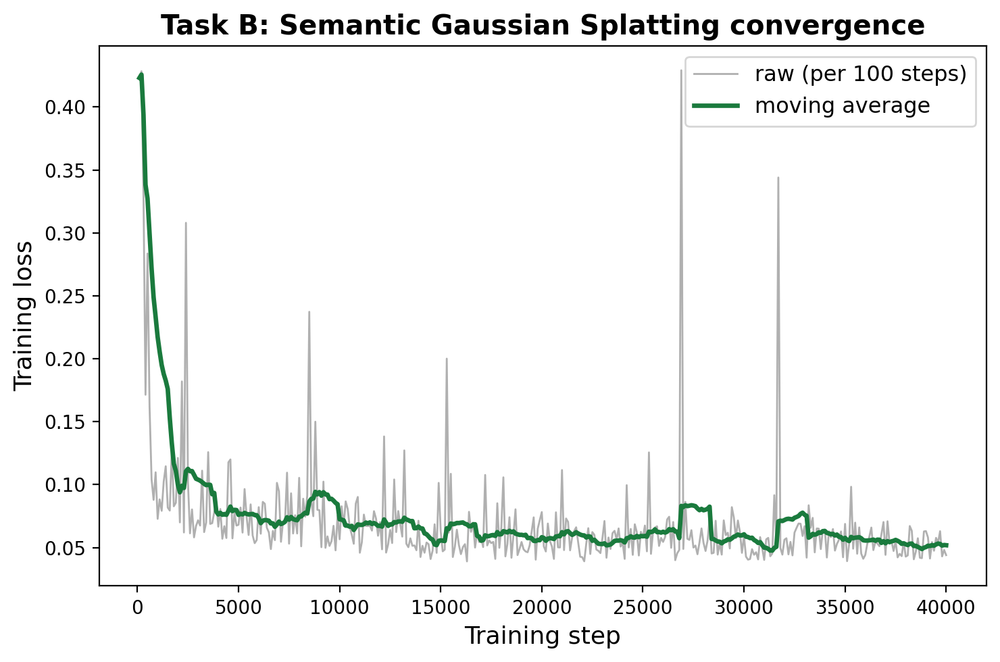

# Semantic 3D Gaussian Splatting for Multi-View Reconstruction of Suspension Bridges

**[NEEDS] Author names, affiliations, IC-SHM 2026 Project 2 team identifier**

---

## Abstract

We present a semantic 3D Gaussian Splatting pipeline for multi-view reconstruction of a
suspension bridge in IC-SHM 2026 Project 2. The model renders RGB images and five-class
semantic maps from query camera poses through a single rasterization pass that composites
color and per-Gaussian semantic logits with shared weights. A SegFormer model trained on
240 labeled images generates pseudo-labels for 100 unannotated images. Together with 30
additional labeled views, these provide 370 training views for the Gaussian model. Sparse
triangulation initializes geometry, observed image colors initialize appearance, and multi-view
plurality voting initializes semantic logits. Thirty labeled views are reserved for testing and
excluded from both optimization and the triangulation, color sampling, and semantic voting
performed by our pipeline. Using the supplied camera calibration and poses, the model achieves
PSNR 22.43 dB, SSIM 0.854, LPIPS 0.321, and 92.08% structural mIoU on this local test split.
Full-resolution training improves structural mIoU by 2.37 percentage points over half-resolution
training in a matched experiment. Qualitative results show that component labels can remain
recognizable despite appearance artifacts, while the coarse cable annotations limit what high
semantic overlap implies about individual cable geometry. These results demonstrate a renderable,
component-labeled bridge representation; accuracy at distant viewpoints and suitability for
quantitative structural measurements remain unverified.

---

## 1. Introduction

Bridge inspection requires access to components that may be difficult or hazardous to reach,
including towers, cable anchorages, and foundations. UAV imaging offers a practical means of
collecting observations across these regions, although substantial human intervention remains
in many inspection workflows [1]. Structure-aware reconstruction and sensor-fusion studies
[2, 3] motivate representations that associate bridge geometry with component identity. Such
representations could support the localization of inspection observations to the deck, cables,
towers, or foundations, provided that their geometric and semantic accuracy is established.

IC-SHM 2026 Project 2 [4] specifies a multi-view semantic reconstruction task using 300 labeled
and 100 unlabeled UAV images, together with estimated camera intrinsics and poses. A submission
must render both an RGB image and a semantic map from supplied test viewpoints. The organizers
evaluate a separate blind test set using visual fidelity, measured by PSNR, SSIM, and LPIPS,
and semantic mIoU, with equal weighting between the two components of the Accuracy Score.
Our experiments use a local holdout from the released data; they do not measure performance on
the organizers' blind test set.

The dataset presents three challenges. First, structural components differ in projected size,
texture, and visibility. In particular, the dataset label *stay_cable* denotes the main cable
and hanger assembly, called the main cable in the brief [4, p. 9]. Its polygons enclose broad
regions that include sky or water between physical strands. High overlap with this annotation
therefore need not imply precise recovery of individual cables. Second, one quarter of the
released images lack semantic annotations, motivating pseudo-labeling to use their viewpoints
for semantic supervision. Third, the supplied camera parameters are SfM estimates, so residual
geometric inconsistency may affect rendering quality.

We develop a pipeline that combines sparse geometric initialization, supervised 2D segmentation,
and a semantic Gaussian representation. The contributions of this study are:

1. An implementation of joint RGB and fixed-class semantic rendering for the bridge dataset,
   using a shared Gaussian rasterization pass and aligned output pixels.
2. A semantic initialization procedure that assigns Gaussian logits from multi-view plurality
   votes over labeled observations of a triangulated sparse cloud.
3. A pseudo-labeling stage that expands semantic supervision from 270 manually labeled views
   to 370 views without additional manual annotation.
4. An evaluation of the resulting system on 30 held-out views, including a matched comparison
   of full- and half-resolution training and an analysis of annotation-related limitations.

Implementation and reproduction instructions are available in the accompanying repository:
[IC-SHM 2026 Project 2](https://github.com/zeki-aitech/ic-shm-2026-project-2).

---

## 2. Related Work

**Structure-from-Motion and multi-view geometry.** Schönberger and Frahm [5] describe the
incremental Structure-from-Motion approach underlying COLMAP. The contest provides camera
calibration, poses, and feature tracks in COLMAP format. We retain these supplied camera
parameters and triangulate sparse points from observations in our training pool (Section 3.2).

**Neural scene representations.** NeRF [6] represents a scene through a coordinate-based
network and synthesizes views by volumetric integration. Kerbl et al. [7] introduce an explicit
representation of anisotropic 3D Gaussians with adaptive density control and tile-based
rasterization, enabling real-time view synthesis in their evaluated scenes. Explicit primitives
provide a convenient location for storing auxiliary scene attributes. Our model uses this
representation with view-independent RGB and a five-dimensional semantic logit vector for
each Gaussian; it does not use view-dependent spherical-harmonic appearance.

**Semantic and feature-augmented scene representations.** Semantic-NeRF [8] jointly learns
appearance, geometry, and semantic predictions in an implicit scene representation. Semantic
logits are integrated along rays and supervised by 2D labels, enabling label propagation and
semantic novel-view rendering. Thus, direct semantic supervision of a renderable scene
representation predates our method.

Feature 3DGS [9] augments Gaussians with feature vectors distilled from 2D models, including
SAM [10] and CLIP-LSeg [11], and uses an N-dimensional rasterizer for RGB and feature rendering.
LangSplat [12] learns per-Gaussian language features, with a scene-specific autoencoder for
compression, to support open-vocabulary queries. Gaussian Grouping [13] instead learns compact
identity encodings from associated SAM masks through a rendered identity-classification loss
and a spatial consistency regularizer, supporting grouping and editing. These methods share the
use of renderable auxiliary Gaussian attributes, but differ in supervision and intended output.

Our application requires class IDs for a fixed set of bridge components, so we optimize five
class logits directly using manually annotated and pseudo-labeled masks. Multi-view votes
initialize these logits before optimization. This initialization uses the provided annotations
without feature distillation; the separate pseudo-labeling stage uses a pretrained SegFormer.
We present the combination as a task-specific system design, rather than claiming auxiliary
attribute rendering itself as a new mechanism.

**Structure-aware bridge segmentation.** Lin et al. [14] introduce a structure-oriented loss
for bridge point-cloud segmentation, incorporating spatially informed weighting and structural
relationships. Their work addresses component-aware segmentation in 3D point clouds, whereas
our initialization transfers labels from 2D observations to sparse points. Task A uses
SegFormer [15], whose hierarchical Transformer encoder produces four feature scales and whose
lightweight all-MLP decoder aggregates them. Its encoder avoids positional encodings, and its
MiT-B0 configuration provides a compact model for fine-tuning on a single GPU.

**Structure-aware reconstruction and inspection.** Hu et al. [2] reconstruct cable-stayed
bridges from multi-view images and a photogrammetric point cloud using a recursive network
that predicts structural relations and component geometry. Li et al. [3] combine UAV LiDAR
and imagery for bridge reconstruction and damage detection. These studies demonstrate
complementary approaches to associating geometry with structural information. Zhang et al. [1]
review 115 UAV-enabled bridge inspection studies and identify remaining automation challenges.
Our scope is narrower than a complete inspection system: we reconstruct appearance and
component labels, without detecting damage or validating displacement, deformation, or cable
force measurements.

---

## 3. Method

Figure 1 summarizes the pipeline. Task A generates pseudo-labels for the 100 unlabeled frames.
In parallel, sparse triangulation and multi-view voting initialize the Gaussian representation.
Task B optimizes this representation using 270 manually labeled views and 100 pseudo-labeled
views, producing RGB and semantic outputs from a query camera pose.

**Figure 1.** Pipeline overview. Geometry and observed RGB initialize Gaussian positions and
colors; plurality votes from 270 labeled views initialize semantic logits. Task A is fine-tuned
on 240 images and selected using 30 validation images. Task B uses these 270 labeled images
plus 100 pseudo-labeled images. Thirty test images are excluded from the model-building steps
performed by our pipeline. The trained model renders RGB and semantic maps from query poses.

### 3.1 Problem Formulation

We are given a set of posed UAV images of a single suspension bridge,
$\{(I_i, \pi_i)\}_{i=1}^{N}$, where $I_i$ is an RGB photograph and $\pi_i$ its camera pose
(position and orientation) recovered by Structure-from-Motion. A subset of these images carries
pixel-level semantic annotations $M_i \in \{0,1,2,3,4\}^{H\times W}$ over five semantic
classes (0: background, 1: deck, 2: stay_cable, 3: tower, 4: foundation); the remainder do not.
Our goal is to learn a 3D scene representation $\mathcal{G}$ such that, for an arbitrary query
pose $\pi_q$ — including poses never observed during acquisition — rendering $\mathcal{G}$ from
$\pi_q$ produces both an RGB image $\hat{I}_q$ and a semantic map $\hat{M}_q$ that closely match
what a camera placed at $\pi_q$ would actually see. This formulation mirrors the contest's blind
evaluation protocol directly: the organizers hold out a set of camera poses, and a submission is
scored purely on how well it renders from those poses, with no access to the underlying ground
truth at inference time.

### 3.2 Camera Geometry and Sparse Point Initialization

The dataset supplies COLMAP [5] SIMPLE_RADIAL camera intrinsics, per-image poses, and feature
tracks for 400 frames, but no precomputed 3D point coordinates. We remove observations from
the 30 test images before triangulation, leaving 86,319 tracks from the 370-image training
pool. Supplied calibration and poses remain fixed throughout reconstruction.

Tracks with at least two observations are triangulated using LO-RANSAC [16]. Candidate points
are estimated from subsets of observations and scored using angular residuals; local refinement
is applied to hypotheses that improve the best consensus found so far. The angular inlier
threshold is 2 degrees, and the minimum triangulation angle is 0.5 degrees. Cheirality checks
reject points behind observing cameras. This yields 84,086 points with a mean reprojection
error of 0.49 pixels, measured after triangulation. An outlier filter then removes points whose
distance from the coordinate-wise median exceeds $Q_3 + 3(Q_3-Q_1)$, where $Q_1$ and $Q_3$
are the quartiles of those distances. The resulting initialization contains 82,518 points.

Task A operates on the original distorted photographs. Sparse color sampling and semantic
voting also use original images and masks, because feature-track coordinates refer to those
images. Task B uses a pinhole convention: images are undistorted using the supplied radial
coefficient ($k_1\approx0.009$), and both manual and pseudo-label masks undergo the identical
coordinate remap with nearest-neighbor interpolation. Task B training, local evaluation, and
rendering therefore use aligned, undistorted images and masks. Test images and masks are
transformed for evaluation only.

### 3.3 Task A: 2D Semantic Pseudo-Labeling

We fine-tune SegFormer [15] with a pretrained MiT-B0 encoder on 240 labeled images. Per-epoch
validation on a separate set of 30 images selects the checkpoint with the highest structural
mIoU. This checkpoint generates masks for the 100 unlabeled images. Task B then uses 270
manually labeled views, including Task A's validation views, and 100 pseudo-labeled views.
Task B is trained for a fixed iteration budget without validation-based checkpoint selection.
The remaining 30 labeled images are reserved for final evaluation and are not used in either
Task A fine-tuning or pseudo-label generation.

Figure 2 illustrates the prediction path. Four feature scales provide spatial detail and
context to the decoder. Its five-class logits are resized to the original image dimensions
before argmax produces a pseudo-mask, which is subsequently undistorted for Task B.

**Figure 2.** SegFormer-based pseudo-label generation after fine-tuning. The MiT-B0 encoder
[15] extracts features at four scales relative to the resized input. The all-MLP decoder
projects, resizes, and fuses these features, with its final classifier producing five-class
logits at one-quarter input resolution. Resizing logits followed by argmax yields a pseudo-mask
at the original image dimensions.

### 3.4 Task B: Semantic 3D Gaussian Splatting

**Representation.** Following 3D Gaussian Splatting [7], we represent the scene as anisotropic
Gaussians. Each Gaussian $g_k$ has a mean $\mu_k\in\mathbb{R}^3$, positive scales
$s_k\in\mathbb{R}_{>0}^3$, a unit rotation quaternion $q_k$, opacity $o_k\in(0,1)$, and
view-independent RGB $c_k\in(0,1)^3$. We additionally optimize semantic logits
$\ell_k\in\mathbb{R}^5$ for four structural classes and background. Scales are stored in log
space and exponentiated; quaternions are normalized; sigmoid transforms constrain opacity
and RGB. Semantic logits remain unconstrained.

**Initialization.** Each sparse point initializes a Gaussian position. Its RGB is the average
of sampled pixel colors over its retained observing views, including unlabeled views but
excluding test views. Each initial scale equals the mean Euclidean distance to the three nearest
other points; rotations start at the identity and opacity at 0.3. Initial scales are isotropic
but can become anisotropic during optimization.

To initialize semantics, each labeled observation in the 270-image labeled training pool
votes for the mask class at its feature-track coordinate. The plurality winner initializes
logits to +2 for that class and -2 for the others. Ties use the fixed priority cable, tower,
foundation, deck, background; points without labeled observations initialize as background.
The same plurality rule applies to all classes. Pseudo-labels supervise subsequent training but
do not participate in this initialization.

Figure 3 shows the coarse cable annotation and an illustrative vote. The polygon includes
regions between physical strands, so the initialization reflects the annotation convention.
The logits remain learnable under semantic supervision; the rendering loss does not impose
an immutable class assignment.

**Figure 3.** Cable annotation and semantic initialization. Left: an undistorted ground-truth
mask overlaid on the correspondingly undistorted photograph; cyan marks the broad cable-and-hanger
region, including sky and river between strands. Right: a schematic vote for one 3D point,
not an extracted real track. Camera triangles face the point. Cable and background each receive
two votes, and the fixed tie-break priority assigns cable.

**Fused rendering.** RGB and semantic logits are concatenated into an eight-channel attribute
vector and passed to the differentiable gsplat rasterizer [17]. Projected Gaussians are
composited in depth order, with the same weights applied to both attributes. For pixel $p$,
let $a_{kp}$ be the effective opacity of the projected footprint of Gaussian $k$, and let
$T_{kp}=\prod_{j<k}(1-a_{jp})$ be its transmittance. The outputs are
$$\hat I_p=\sum_k T_{kp}a_{kp}c_k+T_{\mathrm{end},p}b_I,\qquad
z_p=\sum_k T_{kp}a_{kp}\ell_k+T_{\mathrm{end},p}b_\ell,$$
where $b_I$ and $b_\ell$ are fixed background attributes and
$T_{\mathrm{end},p}=\prod_k(1-a_{kp})$. We use $b_I=(0.5,0.5,0.5)$ and
$b_\ell=(4,-4,-4,-4,-4)$, favoring the background class in uncovered regions.
This formulation shares projection, depth ordering, and compositing across all
eight channels. The semantic map is $\hat M_p=\arg\max_c z_{pc}$.

Cross-entropy is applied to the rendered logits before argmax. For a pixel with label $y_p$,
its gradient to a Gaussian's logits is
$$\frac{\partial\mathcal L_{\mathrm{CE},p}}{\partial\ell_k}
=T_{kp}a_{kp}\left(\operatorname{softmax}(z_p)-e_{y_p}\right),$$
where $e_{y_p}$ is the one-hot target and the compositing weights are held fixed in this
partial derivative. Gradients therefore depend on the blended pixel prediction, not on a
separate classification decision for each Gaussian. Semantic loss also updates geometry and
opacity through the weights. Photometric loss directly updates geometry, opacity, and RGB,
but has no direct gradient to semantic logits.

**Losses.** For each sampled view, optimization minimizes
$$\mathcal L=\mathcal L_{\mathrm{photo}}+\lambda_{\mathrm{sem}}w\mathcal L_{\mathrm{sem}},
\qquad \mathcal L_{\mathrm{photo}}=0.8\mathcal L_1+0.2(1-\mathrm{SSIM}),$$
where $\mathcal L_1$ is mean absolute RGB error and $\mathcal L_{\mathrm{sem}}$ is cross-entropy
averaged over pixels. We use $\lambda_{\mathrm{sem}}=0.5$, with $w=1$ for manual annotations
and $w=0.5$ for pseudo-labels. The latter reduces their semantic-loss contribution without
changing the RGB target or photometric weight. Figure 4 summarizes the representation and losses.

**Figure 4.** Semantic Gaussian representation and joint rendering. Each Gaussian carries
geometry, opacity, RGB, and five semantic logits. Concatenated RGB and logits are rendered with
shared alpha-compositing weights. Rendered logits feed cross-entropy during training and argmax
for class-map generation. Photometric loss supervises RGB; both losses update shared geometry
and opacity. Dashed arrows denote training connections. Semantic colors illustrate class IDs.

**Density control.** The gsplat density-control strategy [17] duplicates or splits Gaussians
according to projected positional gradients and scale, and prunes low-opacity primitives.
These operations adapt representation capacity during training. With the schedule and soft
point-count cap in Section 4.2, the model grows from 82,518 initial points to 600,583 Gaussians.

### 3.5 Rendering for Arbitrary Viewpoints

Inference accepts a world-to-camera rotation and translation, pinhole intrinsics, and image
size. Rasterization returns RGB and five semantic channels; argmax converts the latter to a
class-ID map with values 0–4. This interface supports query poses outside the acquisition set,
although the ability to render a pose does not establish accuracy at that pose. Our local
results use the undistorted convention described in Section 3.2. Evaluation against distorted
photographs would require a matching camera model or coordinate remapping.

### 3.6 Evaluation Protocol

We reserve every tenth image among the 300 labeled frames for testing, yielding 30 test views.
Every ninth image among the remaining 270 forms a 30-view internal validation set; the other
240 images train Task A. Task B uses the 270 train-plus-validation labeled images and all 100
unlabeled images. The 30 test views contribute to neither Task A training or selection, nor
Task B losses, semantic voting, sparse triangulation, or color initialization.

This separation applies to model-building operations performed by our pipeline. We retain the
organizer-supplied calibration and poses, estimated from the released image collection, rather
than estimating a new SfM model from the training subset. Our local holdout is therefore a
conditional view-synthesis evaluation with supplied camera geometry, distinct from the
organizers' unreleased blind test set.

The interleaved split distributes test views across acquisition order but places them near
training frames along the densely sampled flight. It primarily evaluates interpolation near
the observed trajectory. Coverage is uniform in frame index, not necessarily in physical camera
position or viewing angle. A separated trajectory segment would provide a complementary test
of generalization beyond nearby observations. We render each local test pose once with the
final model and compare it with its undistorted photograph and mask using Section 4.3's metrics.

---

## 4. Experiments

### 4.1 Dataset

The released dataset [4] contains 400 UAV images of one suspension bridge at
$1320\times989$ pixels, with shared SIMPLE_RADIAL calibration
($f\approx925.7$ pixels, $k_1\approx0.009$). Three hundred images have polygon annotations
for four structural components and background. The remaining 100 provide RGB observations
for geometry and appearance, and receive pseudo-labels for semantic supervision.

Labelme polygons are rasterized into class-ID masks. Drawing order is deck, tower, foundation,
then cable, with background assigned to unpainted pixels. Drawing cable last preserves its
annotation where polygons overlap. The 300 labeled images are partitioned 240/30/30 as defined
in Section 3.6; the 100 unlabeled images remain separate from that partition. All Task B
comparisons use undistorted image–mask pairs at the evaluation resolution.

### 4.2 Implementation Details

All experiments run on a single NVIDIA RTX 3080 (10 GB). Task A fine-tunes SegFormer (MiT-B0
backbone) for 80 epochs with AdamW (learning rate $6\times10^{-5}$, weight decay
$1\times10^{-4}$, cosine-annealed over training), batch size 8, at a downsampled resolution of
$512\times384$. RGB inputs use ImageNet normalization. Training augmentation comprises
horizontal flipping (probability 0.5), brightness/contrast adjustment (probability 0.3), and
hue/saturation/value adjustment (probability 0.2); masks undergo the corresponding geometric
transform only. The checkpoint with the highest validation mIoU on the 30-image internal
validation split (Section 3.3) is kept for pseudo-labeling. Task B optimizes each Gaussian
parameter group with its own Adam optimizer
and learning rate — means $1.6\times10^{-4}$ (exponentially decayed to 1% of its initial value
over training), scales $5\times10^{-3}$, rotation quaternions $1\times10^{-3}$, opacities
$5\times10^{-2}$, and both color and semantic logits $2.5\times10^{-3}$ — for 40,000 iterations
at full image resolution ($1320\times989$). The semantic loss weight $\lambda_{\text{sem}}$ is
set to 0.5, and pseudo-labeled views are additionally down-weighted by a factor of 0.5 relative
to manually-annotated views when computing $\mathcal{L}_{\text{sem}}$, reflecting their lower
label confidence. Density control is scheduled every 100 steps after step 500 and before step 15,000,
with opacity resets scheduled every 3,000 steps. A 600,000-Gaussian soft cap gates the
entire density-control update: once reached, splitting, pruning, and resets are skipped.
A single update may exceed the cap; our count reaches 600,583 at step 7,400 and remains
constant thereafter. Task B uses seed 42 for view shuffling and tensor random operations.
The two resolution experiments use the same settings and fixed camera poses. We report one
run per resolution, without a multi-seed uncertainty estimate.

### 4.3 Metrics

We evaluate RGB reconstruction with PSNR, SSIM, and LPIPS, and semantic prediction with
per-class IoU and structural mIoU. RGB outputs and targets are scaled to $[0,1]$.
Each visual-fidelity metric is computed per test image and then averaged over the 30 views.
Semantic metrics use a single confusion matrix accumulated over all test pixels.

**PSNR** (peak signal-to-noise ratio; higher is better) is
$$\mathrm{PSNR}=10\log_{10}\frac{1}{\mathrm{MSE}},\qquad
\mathrm{MSE}=\frac{1}{3HW}\sum_{h,w,c}(\hat I_c(h,w)-I_c(h,w))^2.$$
The numerator is one because the RGB dynamic range is normalized to one. PSNR measures
pixel-wise squared error and is reported in decibels; it does not model perceptual salience.

**SSIM** [18] (structural similarity; higher is better) compares local luminance, contrast,
and structure:
$$\mathrm{SSIM}(\hat I,I)=
\frac{(2\mu_{\hat I}\mu_I+c_1)(2\sigma_{\hat I I}+c_2)}
{(\mu_{\hat I}^2+\mu_I^2+c_1)(\sigma_{\hat I}^2+\sigma_I^2+c_2)}.$$
Means, variances, and covariance are computed in local windows, with $c_1=0.01^2$ and
$c_2=0.03^2$ for unit-range images. Evaluation uses uniform $7\times7$ windows, sample
covariance normalization, and averaging across valid spatial locations and RGB channels.
The training loss instead uses $11\times11$ Gaussian windows with standard deviation 1.5,
population covariance, and zero padding. We distinguish these configurations for reproducibility.
SSIM can range from -1 to 1, with 1 denoting identical inputs.

**LPIPS** [19] (learned perceptual image patch similarity; lower is better) compares learned
feature activations:
$$\mathrm{LPIPS}(\hat I,I)=\sum_l\frac{1}{H_lW_l}\sum_{h,w}
\left\|w_l\odot\big(\phi_l(\hat I)_{hw}-\phi_l(I)_{hw}\big)\right\|_2^2.$$
Here $\phi_l$ is a channel-normalized feature map and $w_l$ denotes learned channel weights.
We use the calibrated AlexNet LPIPS model, version 0.1, with RGB tensors mapped to $[-1,1]$.
The metric was developed to reflect perceptual similarity [19]; its sensitivity to particular
bridge defects or cable artifacts is not established by our experiments.

**Semantic accuracy.** For class $c$, pooled counts give
$$\mathrm{IoU}_c=\frac{TP_c}{TP_c+FP_c+FN_c},\qquad
\mathrm{mIoU}_{\mathrm{struct}}=\frac14\sum_{c\in\mathcal C}\mathrm{IoU}_c,\quad
\mathcal C=\{\mathrm{deck},\mathrm{stay\_cable},\mathrm{tower},\mathrm{foundation}\}.$$
Pooling counts differs from averaging per-image IoUs. Equivalently, each class's pooled IoU
weights its per-image IoUs by their union sizes, omitting images with zero union. The subsequent
mean across classes weights each structural class equally. We use four-class mIoU to focus
on bridge components and report background IoU separately. This is our stated local evaluation
convention; the brief [4] does not explicitly resolve background inclusion in its mIoU definition.
For completeness, we also report
$\mathrm{mIoU}_{\mathrm{all}}=\frac15\sum_{c=0}^{4}\mathrm{IoU}_c$, which includes background.

**Illustrative combined score.** The brief specifies equal weighting between visual fidelity
and semantic accuracy but does not define the normalization and aggregation of the three visual
metrics [4]. For internal comparison only, we report
$$V_{\mathrm{illustrative}}=\frac13\left[
\operatorname{clip}(\overline{\mathrm{PSNR}}/35,0,1)+\overline{\mathrm{SSIM}}+
\operatorname{clip}(1-\overline{\mathrm{LPIPS}},0,1)\right],\qquad
A_{\mathrm{illustrative}}=\tfrac12 V_{\mathrm{illustrative}}+
\tfrac12\mathrm{mIoU}_{\mathrm{struct}}.$$
Bars denote means over test views, and 35 dB is a chosen normalization reference. This
illustrative score is not an organizer-reported score or a predictor of competition ranking.

---

## 5. Results & Discussion

### 5.1 Main Results

Task A and Task B are evaluated on different splits and prediction tasks. Table 1 reports
SegFormer's 2D segmentation accuracy on its 30-image internal validation set, used to select
the pseudo-labeling checkpoint. Tables 2–4 report rendered predictions from the Gaussian model
on the separate 30-image test set.

**Table 1: Task A (SegFormer) per-class validation IoU**, on the 30-image internal validation
split used for checkpoint selection (Section 3.3), *not* the 30-image test split evaluated in
Tables 2-4.

| Class | IoU |
| :--- | :---: |
| deck | 92.80% |
| stay_cable | 89.17% |
| tower | 78.20% |
| foundation | 66.48% |
| (background, reported for completeness, excluded from structural mIoU) | 98.64% |
| **Structural mIoU (4 classes)** | **81.67%** |
| mIoU including background (5 classes) | 85.06% |

Tables 2 and 3 report the final Task B model's aggregate metrics and class-wise IoU. Test RGB
images and masks are excluded from the model-building operations listed in Section 3.6.
Predictions are obtained using the same rendering procedure described in Section 3.5.

**Table 2: Task B (semantic Gaussian Splatting) overall holdout performance.**

| Metric | Value |
| :--- | :---: |
| PSNR | 22.43 dB |
| SSIM | 0.854 |
| LPIPS | 0.321 |
| Structural mIoU (4 classes) | **92.08%** |
| mIoU including background (5 classes) | 93.5% |
| Illustrative Accuracy Score | 0.823 |

**Table 3: Task B per-class IoU**, on the same 30-image test holdout as Table 2.

| Class | IoU |
| :--- | :---: |
| deck | 95.72% |
| stay_cable | 91.76% |
| tower | 92.37% |
| foundation | 88.49% |
| (background, reported for completeness, excluded from structural mIoU) | 99.20% |

Figure 5 compares the four structural IoUs using a zero-based axis. Deck has the highest IoU,
followed by tower, cable, and foundation. Cable is 0.61 percentage points below tower and
3.27 points above foundation, despite the physical slenderness of its strands. The relationship
between this result and the annotation convention is examined in Section 5.2.

**Figure 5.** Structural-class IoUs on 30 test views. Class colors identify components; the
dashed line marks structural mIoU (92.08%). The vertical axis starts at zero. Background IoU
is reported separately in Table 3.

### 5.2 Discussion — Per-Class Behavior

Deck reaches 95.72% IoU, followed by tower at 92.37%, cable at 91.76%, and foundation at
88.49%. Deck's relatively large projected area and visible surface texture are plausible
contributors, but this experiment does not isolate their effects from geometry, annotation
quality, or optimization.

Physical cable strands occupy few pixels, yet the scored cable class includes the much broader
polygon enclosing the cable-and-hanger assembly. On the undistorted test masks, cable covers
7.12% of pixels and deck 4.99%, compared with 1.69% for tower and 0.61% for foundation.
The cable annotation is therefore the largest structural region by pixel count, despite the
thinness of the physical strands. As Figure 6 shows, rendered cable masks reproduce broad
annotated regions. Their high IoU measures agreement with this convention and does not establish
recovery of individual strands or improved cable geometry beyond the annotation resolution.

Foundation's lower IoU cannot be attributed to fewer observations per sparse point alone.
Among points assigned each class by the initialization vote, the mean number of retained RGB
observations is 6.57 for foundation and 3.12 for deck. These counts include unlabeled views;
restricting them to labeled observations participating in the semantic vote gives 4.70 and 2.85,
respectively. Track length measures repeated observation, not angular diversity, visibility of
an entire component, or annotation quality. Foundation's small image footprint may increase
sensitivity to boundary errors, but identifying the dominant cause requires a dedicated error
analysis. These descriptive statistics do not establish a causal explanation for the class ranking.

### 5.3 Qualitative Results

The metrics in Section 5.1 summarize error over the full holdout set as a single number per
metric, but do not show where the model succeeds or fails, or what a rendered view actually looks
like. We complement them with three qualitative figures.

Figure 6 shows four held-out views (010, 050, 250, 300), each as rendered RGB, the real
photograph, the rendered semantic map, and the ground-truth mask. 250 is the cleanest RGB
reconstruction of the four by every visual-fidelity metric (PSNR 22.05 dB, SSIM 0.844, LPIPS
0.304), with only a faint streaking artifact visible over the river; 050 follows closely (21.40
dB, 0.828, 0.340). 010 and 300 both show visible RGB degradation - soft, cloud-like blur
artifacts over the background water and sky - and score comparably weak on all three metrics
(PSNR 20.55/21.01 dB, SSIM 0.818/0.820, LPIPS 0.382/0.384): 010 is marginally worse on PSNR and
SSIM, 300 marginally worse on LPIPS, so neither is unambiguously the single weakest view in this
set. Notably, the rendered semantic map stays close to the ground truth in all four views,
including 010 and 300, despite their degraded RGB quality. A plausible
explanation is that per-pixel classification is a coarser, lower-precision target than exact
color reconstruction — an appearance error large enough to visibly corrupt RGB may still leave
the arg-max class unchanged — but we present this as an illustrative observation from this set of
views rather than a claim established over the full holdout.

**Figure 6.** RGB and semantic renders vs. ground truth on four held-out views (010, 050, 250,
300): rendered RGB, real photograph, rendered semantic map, and ground-truth mask.
Only the two semantic columns use the class-color palette; RGB columns retain image colors.

Figure 7 illustrates rendering along a constructed path between the supplied poses of images
280 and 300, both members of the local test split. Rotation is interpolated by quaternion
SLERP; world-to-camera translation is interpolated linearly at
$t\in\{0,0.25,0.5,0.75,1\}$. The camera center is $C=-R^\top T$, so this construction does
not impose a straight camera-center path or guarantee containment within the flight envelope.
The three intermediate poses have no corresponding ground-truth images and serve only as
qualitative demonstrations of the rendering interface.

Appearance artifacts are visible at both endpoints and are more pronounced in several
intermediate frames, where blur and streaking obscure image detail. The broad cable and deck
regions remain identifiable, but their boundaries develop holes and irregular fragments. Thus,
semantic rendering also degrades along this path. Shared rasterization preserves pixel alignment
between RGB and semantic outputs; it does not guarantee correct reconstruction at novel poses.

**Figure 7.** RGB (top) and semantic maps (bottom) at five interpolated poses between images
280 and 300. SLERP is applied to rotation and linear interpolation to world-to-camera
translation, not directly to camera position. The intermediate views have no ground truth.

Figure 8 presents two interactive-viewer screenshots of the same trained representation.
Panel (a) uses learned RGB; panel (b) replaces each Gaussian's color with its argmax class color
before rasterization. Each panel is rendered from a viewer camera, and the screenshots are
not a registered image pair. Major component regions are recognizable, while dispersed and
partially transparent splats remain visible around the bridge. This visualization illustrates
per-Gaussian label distribution without establishing geometric accuracy or the isolated effect
of semantic initialization.

Recoloring each Gaussian before compositing also differs from the evaluated semantic output,
which composites logits before taking pixel-wise argmax. The latter, used in Figures 6 and 7,
is the prediction assessed by the reported IoU metrics.

**Figure 8.** Interactive-viewer screenshots of the trained Gaussian representation.
(a) Learned RGB appearance. (b) Per-Gaussian argmax labels displayed as colors: deck red,
cable cyan, tower green, foundation yellow, background gray. Viewpoints are not registered.
The class-colored splat visualization is distinct from a rendered-logit argmax semantic map.

### 5.4 Training Convergence

Figures 9 and 10 summarize optimization trajectories for the models evaluated in Section 5.1.
Task A's mean training loss falls rapidly and then changes slowly, while internal-validation
mIoU approaches a plateau. The maximum validation mIoU is 81.67% at epoch 69; that checkpoint
is used for pseudo-labeling. The curve supports diminishing validation improvement within this
80-epoch run, but cannot establish a global optimum or rule out overfitting to the validation set.

**Figure 9.** Task A training loss (red, left axis) and structural validation mIoU (blue, right
axis) over 80 epochs. Training uses 240 images; validation uses the separate 30-image internal
split. The final 30-image test set is not used for checkpoint selection.

Task B logs the loss of one sampled view every 100 steps. Figure 10 shows these values and
a 15-sample trailing moving average, spanning approximately 1,500 steps. The average decreases
substantially early in training and fluctuates within a narrower range later. Spikes remain
after the Gaussian count reaches its cap at step 7,400. View-dependent difficulty may contribute,
but the logs do not isolate the causes of individual spikes or measure held-out performance
throughout optimization.

**Figure 10.** Task B loss for the full-resolution 40,000-step run: single-view samples logged
every 100 steps (gray) and their 15-sample trailing moving average (green). These are training
losses, not test metrics.

The horizontal axes differ because Task A reports an average over an epoch, whereas Task B
performs one rendered-view optimization step at a time. Their loss magnitudes and fluctuations
are therefore not directly comparable. Final test performance is reported separately in
Tables 2 and 3.

### 5.5 Ablation: Training Resolution

Table 4 compares half- and full-resolution training with the same 40,000-step budget,
240/30/30 labeled split, pseudo-masks, initialization, loss weights, density-control settings,
and fixed supplied poses. Both runs are evaluated at full resolution on the same 30 test views.
The full-resolution row is the model reported in Tables 2 and 3.

**Table 4: Effect of training resolution on local test performance.** One run per resolution,
with otherwise matched settings and full-resolution evaluation.

| Training resolution | PSNR | SSIM | LPIPS | mIoU |
| :--- | :---: | :---: | :---: | :---: |
| Half (660x494) | 22.03 | 0.838 | 0.330 | 89.71% |
| **Full (1320x989)** | **22.43** | **0.854** | **0.321** | **92.08%** |

Full-resolution training improves PSNR by 0.40 dB, SSIM by 0.016, and structural mIoU by 2.37
percentage points, while reducing LPIPS by 0.009. Finer supervision may help preserve boundaries
and appearance detail, although this comparison does not isolate that mechanism from changes
in optimization and density control induced by resolution. Training takes approximately
46 minutes at full resolution and 18 minutes at half resolution on the same GPU. These results
support the full-resolution configuration for this dataset and budget; variation across random
seeds, other scenes, and other training budgets is not quantified by this paired experiment.

---

## 6. Conclusion

We presented a semantic 3D Gaussian Splatting system for the RGB-and-semantic rendering task
in IC-SHM 2026 Project 2 [4]. Sparse geometry and observed colors initialize the Gaussian
representation, multi-view plurality votes initialize semantic logits, and SegFormer
pseudo-labels extend semantic supervision to 370 views. Shared rasterization produces aligned
RGB images and class maps. On a local 30-view test split using supplied camera parameters,
the system achieves PSNR 22.43 dB, SSIM 0.854, LPIPS 0.321, and 92.08% structural mIoU.
A matched resolution experiment favors full-resolution training within the tested budget.

The results establish agreement with the released annotations near the acquisition trajectory,
not survey-grade geometric accuracy or unrestricted novel-view fidelity. Cable IoU reflects
coarse region annotations, and constructed novel poses expose artifacts in both RGB and semantic
outputs. The system has not been evaluated for damage detection, deformation measurement, or
structural response estimation. Future work could test spatially separated holdouts, assess
geometry against independent measurements, and investigate finer cable annotations. These steps
would clarify the representation's suitability as a component-aware input to bridge inspection
and structural health monitoring workflows.

---

## References

1. Zhang, C., Zou, Y., Wang, F., del Rey Castillo, E., Dimyadi, J., & Chen, L. (2022) — Towards
   fully automated unmanned aerial vehicle-enabled bridge inspection: Where are we at?
   Construction and Building Materials, 347, 128543.
2. Hu, F., Zhao, J., Huang, Y., & Li, H. (2021) — Structure-aware 3D reconstruction for
   cable-stayed bridges: A learning-based method. Computer-Aided Civil and Infrastructure
   Engineering, 36(1), 89–108.
3. Li, H., Chen, Y., Liu, J., Che, C., Meng, Z., & Zhu, H. (2024) — High-resolution model
   reconstruction and bridge damage detection based on data fusion of unmanned aerial vehicles
   light detection and ranging data imagery. Computer-Aided Civil and Infrastructure
   Engineering, 39, 1197–1217.
4. IC-SHM 2026 Organizing Committee (2026) — The 4th International Project Competition
   for Structural Health Monitoring (IC-SHM 2026). Competition brief, Project 2, pp. 9–10.
5. Schönberger, J. L., & Frahm, J.-M. (2016) — Structure-from-Motion Revisited. CVPR.
6. Mildenhall, B., Srinivasan, P. P., Tancik, M., Barron, J. T., Ramamoorthi, R., & Ng, R. (2020)
   — NeRF: Representing Scenes as Neural Radiance Fields for View Synthesis. ECCV, 405–421.
7. Kerbl, B., Kopanas, G., Leimkühler, T., & Drettakis, G. (2023) — 3D Gaussian Splatting for
   Real-Time Radiance Field Rendering. ACM Transactions on Graphics, 42(4), Article 139.
8. Zhi, S., Laidlow, T., Leutenegger, S., & Davison, A. J. (2021) — In-Place Scene Labelling and
   Understanding with Implicit Scene Representation. ICCV.
9. Zhou, S., Chang, H., Jiang, S., Fan, Z., Zhu, Z., Xu, D., Chari, P., You, S., Wang, Z., &
   Kadambi, A. (2024) — Feature 3DGS: Supercharging 3D Gaussian Splatting to Enable Distilled
   Feature Fields. CVPR.
10. Kirillov, A., Mintun, E., Ravi, N., Mao, H., Rolland, C., Gustafson, L., Xiao, T., Whitehead,
   S., Berg, A. C., Lo, W.-Y., et al. (2023) — Segment Anything. ICCV.
11. Li, B., Weinberger, K. Q., Belongie, S., Koltun, V., & Ranftl, R. (2022) — Language-Driven
    Semantic Segmentation. ICLR.
12. Qin, M., Li, W., Zhou, J., Wang, H., & Pfister, H. (2024) — LangSplat: 3D Language Gaussian
    Splatting. CVPR.
13. Ye, M., Danelljan, M., Yu, F., & Ke, L. (2024) — Gaussian Grouping: Segment and Edit Anything
    in 3D Scenes. ECCV.
14. Lin, C., Abe, S., Zheng, S., Li, X., & Chun, P.-J. (2025) — A structure-oriented loss
    function for automated semantic segmentation of bridge point clouds. Computer-Aided Civil
    and Infrastructure Engineering, 40, 801–816.
15. Xie, E., Wang, W., Yu, Z., Anandkumar, A., Alvarez, J. M., & Luo, P. (2021) — SegFormer:
    Simple and Efficient Design for Semantic Segmentation with Transformers. NeurIPS.
16. Chum, O., Matas, J., & Kittler, J. (2003) — Locally Optimized RANSAC. DAGM-Symposium
    (Pattern Recognition), LNCS vol. 2781, 236–243.
17. Ye, V., Li, R., Kerr, J., Turkulainen, M., Yi, B., Pan, Z., Seiskari, O., Ye, J., Hu, J.,
    Tancik, M., & Kanazawa, A. (2025) — gsplat: An Open-Source Library for Gaussian Splatting.
    Journal of Machine Learning Research, 26(34), 1–17.
18. Wang, Z., Bovik, A. C., Sheikh, H. R., & Simoncelli, E. P. (2004) — Image Quality Assessment:
    From Error Visibility to Structural Similarity. IEEE Transactions on Image Processing, 13(4),
    600–612.
19. Zhang, R., Isola, P., Efros, A. A., Shechtman, E., & Wang, O. (2018) — The Unreasonable
    Effectiveness of Deep Features as a Perceptual Metric. CVPR, 586–595.
