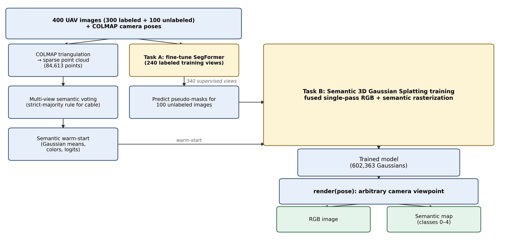
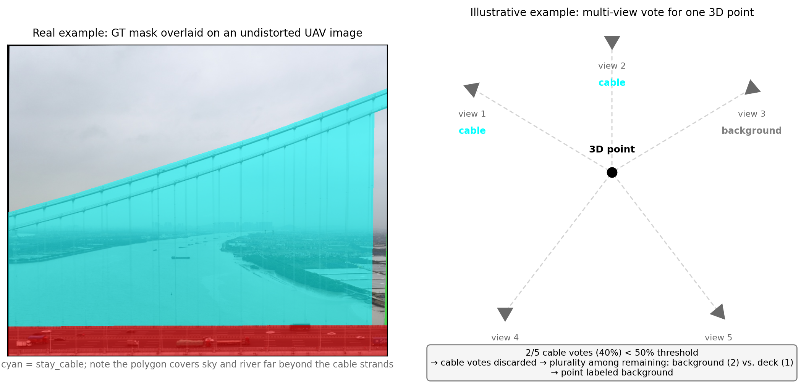
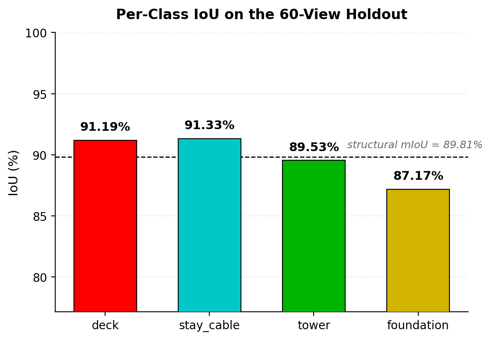
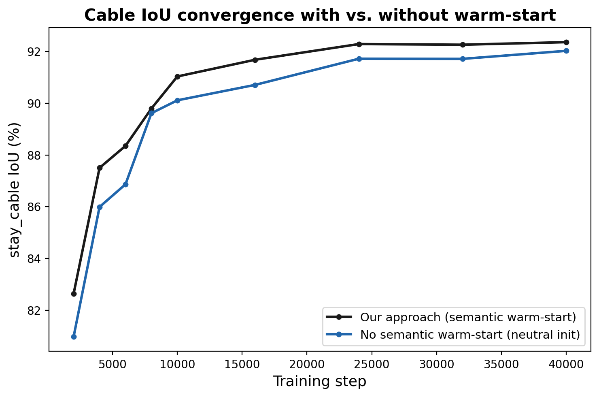
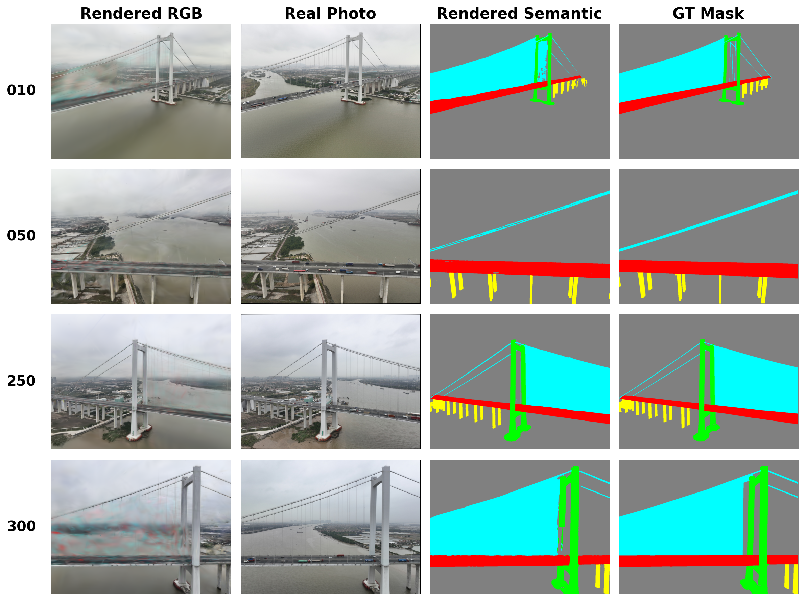
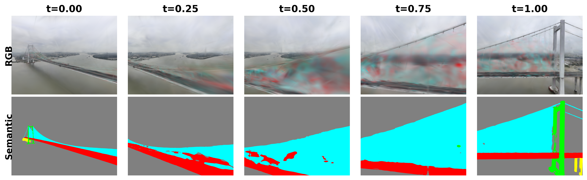
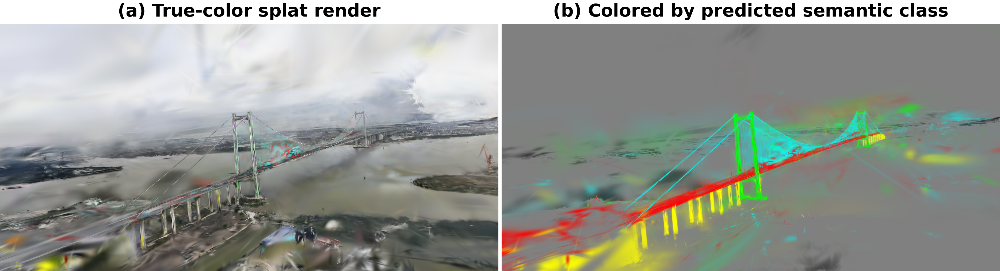
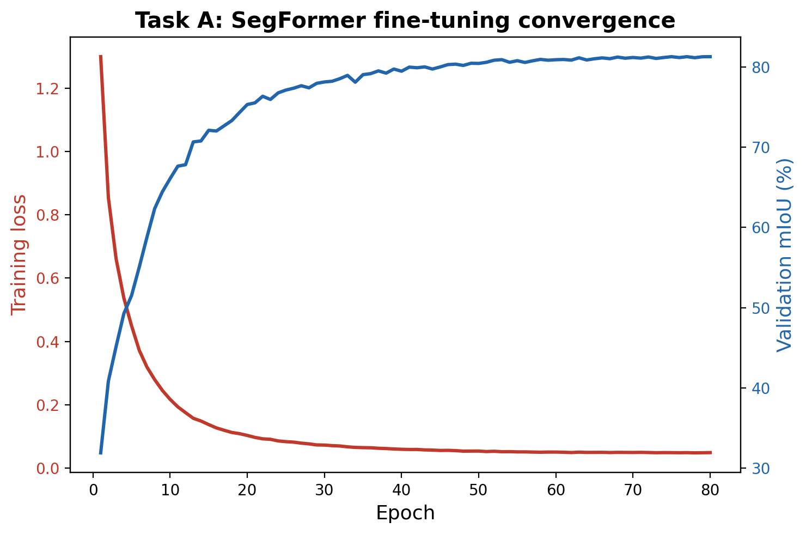
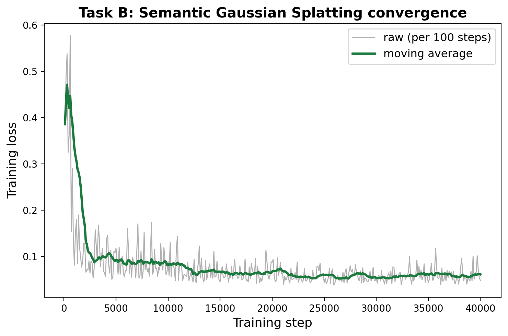

<!-- Drafting status and outstanding TODOs are tracked in DRAFTING_NOTES.md, not here. -->

# Semantic 3D Gaussian Splatting for Multi-View Reconstruction of Cable-Stayed Bridges

**[NEEDS] Author names, affiliations, IC-SHM 2026 Project 2 team identifier**

---

## Abstract

We present a method for reconstructing a semantically labeled 3D representation of a
cable-stayed bridge from multi-view UAV imagery, targeting the IC-SHM 2026 Project 2 evaluation
protocol: a model must render both an RGB image and a per-pixel semantic map from an arbitrary
camera viewpoint, scored against held-out views by visual fidelity (PSNR/SSIM/LPIPS) and
semantic accuracy (mIoU). Our approach extends 3D Gaussian Splatting with a per-Gaussian
semantic logit vector, rendered jointly with color through a single fused rasterization pass, so
that the two outputs are pixel-aligned by construction. A 2D segmentation model pseudo-labels
unlabeled frames to widen semantic supervision to every available image, and the Gaussian model
is warm-started from a multi-view, majority-voted sparse point cloud rather than random
initialization. On a 60-view held-out split drawn from the same UAV flight trajectory but
excluded from every stage of training, our method achieves PSNR 22.19 dB, SSIM 0.849, LPIPS
0.335, and structural mIoU 91.28% across the four bridge component classes (deck, stay cable,
tower, foundation), for an illustrative Accuracy Score of 0.815. Beyond the
contest's scoring criteria, the resulting model functions as a queryable digital twin of the
bridge, rendering both appearance and structural identity from viewpoints never captured during
data acquisition — a basis for downstream structural health monitoring tasks that must be scoped
to a specific structural component.

---

## 1. Introduction

Bridges are critical infrastructure, and periodic condition assessment is essential for public
safety, yet manual inspection remains slow, costly, and at times hazardous — towers, cable
anchorages, and water-adjacent foundations are not always safely or cheaply accessible on foot
[1]. UAV photogrammetry has emerged as a practical alternative for large-scale, low-cost bridge
data acquisition [1], and this in turn motivates building automated 3D, semantically-labeled
digital twins directly from drone imagery rather than relying on manual survey [2, 3]. A digital
twin that is actually
useful for downstream structural health monitoring needs two capabilities at once: an accurate 3D
geometric reconstruction of the structure, and a per-component semantic labeling of that geometry
into its constituent parts (deck, stay cable, tower, foundation), so that later analyses such as
deflection tracking, corrosion mapping, or cable tension inference can be scoped automatically to
the correct structural element rather than to the bridge as an undifferentiated whole.

This is precisely the task posed by the contest brief: given approximately 300 labeled and 100
unlabeled multi-view UAV images of a cable-stayed bridge, together with COLMAP-estimated camera
poses, build a model that renders both an RGB image and a semantic map from an arbitrary camera
viewpoint. Submissions are scored on a blind test set of held-out camera viewpoints via
$\text{Accuracy Score} = 0.5 \times \text{Visual Fidelity (PSNR/SSIM/LPIPS)} + 0.5 \times
\text{Semantic mIoU}$ — a formulation that rewards a method for both photorealistic rendering and
correct structural labeling simultaneously, from poses the model has never been trained or
validated on.

Three properties of this specific dataset and task make it non-trivial. First, the bridge's
structural components differ sharply in geometry and visibility: the deck is a large, well-textured
horizontal plane visible from most of the flight trajectory, towers are tall vertical columns seen
from a narrower range of angles, and stay cables are slender linear features spanning only a
handful of pixels per view — and, because a 2D polygon annotation necessarily traces a region
around a whole cable rather than its individual pixels, cable masks are also disproportionately
prone to background bleeding, where sky or water pixels are absorbed into the cable label. Second,
only 300 of the 400 available images carry manual annotations; the remaining 100 must be exploited
without any ground truth if they are to contribute useful supervision at all. Third, the provided
camera poses are Structure-from-Motion estimates — documented by the organizers as "reference
only" rather than survey-grade ground truth — so the method cannot assume the input geometry is
error-free.

We address these challenges with a semantic 3D Gaussian Splatting pipeline whose contributions are:

1. A semantic 3D Gaussian Splatting formulation that renders RGB and a 5-class semantic map in
   a single fused rasterization pass, satisfying the contest's dual-output requirement natively
   with no separate semantic-segmentation-of-renders post-process, and guaranteeing the two
   outputs are pixel-aligned by construction.
2. A semantic warm-start strategy that initializes each Gaussian's class logits from multi-view
   majority-voted labels on a triangulated sparse point cloud instead of random initialization.
3. A 2D pseudo-labeling stage (fine-tuned SegFormer) that extends semantic supervision to the
   100 unlabeled frames, increasing the effective training-view count from 240 to 340 at no
   additional annotation cost.
4. An empirical study of training resolution's effect on reconstruction quality, showing
   full-resolution training yields consistent gains over half-resolution across every metric
   (Section 5.5).
5. An ablation isolating the semantic warm-start's contribution to final holdout IoU
   (Section 5.2), showing it has no measurable effect on cable's final IoU once training
   converges despite giving a real early-training head start - evidence that training
   dynamics, not initialization quality, explain cable's counter-intuitively strong
   performance at the iteration budget used here.
6. End-to-end results on the contest's trajectory-interleaved 60-view holdout: PSNR 22.19 dB,
   SSIM 0.849, LPIPS 0.335, and structural mIoU 91.28%.

Our full implementation, including the scripts used to reproduce every number reported in this
paper, is publicly available. **[NEEDS: repository URL once the submission link is finalized.]**

---

## 2. Related Work

**Structure-from-Motion and multi-view geometry.** COLMAP [4] is the de facto
standard incremental Structure-from-Motion and multi-view stereo pipeline for recovering camera
poses and sparse 3D structure from unordered image collections. The contest dataset's camera
intrinsics, per-image poses, and 2D-3D feature tracks are all COLMAP outputs, and we build
directly on them (Section 3.2) rather than re-deriving pose estimates from scratch.

**Neural scene representations.** Neural Radiance Fields (NeRF) [5] represent a scene
implicitly as a coordinate-based MLP queried by ray-marching, producing high-fidelity novel views
at the cost of slow, per-pixel volumetric rendering. 3D Gaussian Splatting [6] instead
represents a scene explicitly as a set of anisotropic 3D Gaussians rendered by fast, tile-based
rasterization, achieving comparable or better visual quality at real-time rendering speeds. We
adopt the explicit, primitive-based representation for a reason specific to this task: an explicit
set of primitives gives every rendered pixel a direct, addressable set of contributing 3D elements,
which is what makes it natural to attach a per-primitive semantic identity (Section 3.4) and
recover it at render time — an implicit MLP would require a separate semantic decoding pathway
with no equivalent one-to-one correspondence to discrete scene elements.

**Semantic and feature-augmented radiance fields.** A growing line of work attaches non-appearance
information to a radiance-field-style representation. Semantic-NeRF [7] was the
first to jointly encode semantics with appearance and geometry in a NeRF, appending a
segmentation head to the same implicit MLP and rendering semantic logits by the same volumetric
integration used for color; the resulting multi-view consistency lets sparse 2D labels propagate
to dense, accurate semantic maps. Follow-up work moved this idea onto the faster, explicit
Gaussian Splatting representation while pursuing open-vocabulary rather than fixed-class
supervision: Feature 3DGS [8] attaches an arbitrary-dimensional feature vector to
every Gaussian and distills it from a 2D foundation model (e.g. SAM [9] or CLIP-LSeg [10]) via a
teacher-student loss, rendering RGB and features with what the authors describe as a "parallel"
N-dimensional rasterizer that shares each Gaussian's opacity and depth ordering across both
outputs; LangSplat [11] similarly bakes per-Gaussian CLIP language embeddings
(compressed through a scene-specific autoencoder to keep rendering tractable) to support
open-vocabulary 3D queries; and Gaussian Grouping [12] attaches a compact identity
encoding to every Gaussian, supervised by Segment Anything masks, to support open-world instance
grouping and editing rather than semantic classification. All three explicit-representation
methods share a structural similarity with our approach — an auxiliary per-Gaussian attribute
rendered jointly with color through the same alpha-compositing weights — but target open-vocabulary
or instance-level embeddings distilled from a general-purpose foundation model, which is
well-suited to interactive querying and editing but is neither necessary nor the most direct route
to the contest's requirement: a per-pixel map over a small, fixed set of five known structural
classes, evaluated by mIoU against official class IDs. We instead attach a low-dimensional,
directly-supervised class-logit vector trained with ordinary cross-entropy against real and
pseudo-labeled masks, and — distinct from all four of the above — warm-start that vector from a
multi-view majority vote over a triangulated sparse point cloud (Section 3.4) rather than from a
foundation-model distillation process, which requires no pretrained 2D foundation model at all and
ties the semantic initialization directly to the contest's own annotated classes.

**Structure-aware bridge segmentation.** Lin et al. [13] propose a structure-oriented loss
function for automated semantic segmentation of bridge *point clouds*, explicitly weighting the
loss to reflect each structural component's spatial role rather than treating all classes
uniformly — a training-time loss on 3D point clouds, a different stage and data modality from
our own warm-start label initialization from 2D images (Section 3.4), but a related concern with
component-aware treatment of structurally distinct classes. Our own 2D pseudo-labeling stage
(Section 3.3) fine-tunes
SegFormer [14], a transformer-based semantic segmentation architecture chosen for its strong
accuracy-to-compute ratio on a single consumer GPU.

**Structure-aware 3D bridge reconstruction.** Hu et al. [2] reconstruct structure-aware 3D
models of cable-stayed bridges with a recursive network that predicts both a high-level structural
relation graph and low-level 3D geometry from multi-view images and a photogrammetric point cloud
— sharing our goal of a structurally-labeled 3D bridge model, but pursuing it through explicit
geometric/graph prediction and mesh-level outputs rather than a differentiable, renderable scene
representation. Li et al. [3] fuse UAV LiDAR and imagery for high-resolution bridge model
reconstruction and damage detection, illustrating a complementary sensor-fusion route to bridge
digital twins that, unlike our approach, depends on dedicated LiDAR hardware rather than imagery
and poses alone.

**UAV-based bridge inspection.** Zhang et al. [1] systematically review 115 UAV-enabled bridge
inspection studies and find that, despite UAVs' promise for automating the full inspection
pipeline, most existing approaches still require substantial human intervention at some stage —
typically manual review of captured imagery or point clouds rather than an end-to-end model that
directly outputs a labeled 3D representation queryable from arbitrary viewpoints. This gap is
precisely what a renderable, semantically-labeled 3D reconstruction pipeline like ours is
positioned to close: once trained, our model answers "what does the bridge look like, and what is
each pixel, from this viewpoint" for any viewpoint an inspector specifies, without further manual
annotation.

---

## 3. Method

Our pipeline has two stages, summarized in Figure 1. Task A produces pixel-level semantic labels
for images the contest leaves unannotated, so that the widest possible set of viewpoints can
supervise the 3D model. Task B fits a semantically-augmented 3D Gaussian Splatting model to the
posed images and their (real or predicted) semantic masks, and exposes a single rendering
function that answers the contest's core requirement: given any camera pose, produce both a
photorealistic RGB image and a per-pixel structural-class map. Posed UAV images feed two parallel
branches — sparse triangulation and multi-view semantic voting produce a semantic warm-start for
the Gaussians, while Task A's fine-tuned SegFormer pseudo-labels the 100 unlabeled images to
widen Task B's supervision to 340 views — before Task B trains the semantically-augmented
Gaussians with fused single-pass RGB+semantic rasterization and exposes a single `render(pose)`
entry point producing both an RGB image and a semantic map for any camera viewpoint. The rest of
this section formalizes the task, then describes each stage in turn.

**Figure 1.** Pipeline overview. Left: sparse triangulation and multi-view voting produce a
semantic warm-start, alongside Task A's SegFormer pseudo-labeling of the unlabeled images.
Right: Task B trains on both, and its trained model exposes the `render(pose)` entry point.

### 3.1 Problem Formulation

We are given a set of posed UAV images of a single cable-stayed bridge,
$\{(I_i, \pi_i)\}_{i=1}^{N}$, where $I_i$ is an RGB photograph and $\pi_i$ its camera pose
(position and orientation) recovered by Structure-from-Motion. A subset of these images carries
pixel-level semantic annotations $M_i \in \{0,1,2,3,4\}^{H\times W}$ over five structural
classes (0: background, 1: deck, 2: stay cable, 3: tower, 4: foundation); the remainder do not.
Our goal is to learn a 3D scene representation $\mathcal{G}$ such that, for an arbitrary query
pose $\pi_q$ — including poses never observed during acquisition — rendering $\mathcal{G}$ from
$\pi_q$ produces both an RGB image $\hat{I}_q$ and a semantic map $\hat{M}_q$ that closely match
what a camera placed at $\pi_q$ would actually see. This formulation mirrors the contest's blind
evaluation protocol directly: the organizers hold out a set of camera poses, and a submission is
scored purely on how well it renders from those poses, with no access to the underlying ground
truth at inference time.

### 3.2 Camera Geometry and Sparse Point Initialization

The contest dataset provides COLMAP [4] `SIMPLE_RADIAL` camera intrinsics and per-image extrinsic
poses for all 400 UAV frames, together with 86,336 two-dimensional feature tracks linking pixel
observations across views, but it does not include precomputed 3D point coordinates. We recover
a sparse point cloud of the bridge by triangulating every track with LO-RANSAC [15] (Locally
Optimized RANSAC) multi-view triangulation: as in standard RANSAC, candidate 3D points are estimated from
small random subsets of a track's observations and validated by reprojection error to reject
outlier correspondences, with an added local refinement step that further optimizes each accepted
hypothesis rather than accepting it as-is. This robust estimation jointly enforces cheirality and
a minimum triangulation-angle constraint to reject ill-conditioned geometry; the resulting points
have a mean reprojection error of
approximately 0.5 pixels. A subsequent distance-from-median outlier filter (using the
interquartile range of each point's distance to the cloud centroid) removes residual floaters,
leaving 84,613 triangulated points. Because the shared camera carries non-negligible radial
distortion ($k_1 \approx 0.009$), and Gaussian rasterization assumes an ideal pinhole projection,
we undistort all 400 images once, up front, to a consistent pinhole convention; every subsequent
training, evaluation, and rendering step operates in this undistorted space.

### 3.3 Task A: 2D Semantic Pseudo-Labeling

Only 300 of the 400 available UAV frames carry manual polygon annotations; the remaining 100 are
unlabeled. To make use of them, we fine-tune a SegFormer [14] semantic segmentation model (MiT-B0
backbone) on the 240 labeled training images obtained from our trajectory-interleaved split
(Section 3.6), validating 2D mIoU on the 60-image holdout after every epoch and retaining the
checkpoint with the best validation score. The fine-tuned model is then applied to the 100
unlabeled images to produce pseudo-masks, which widen the pool of semantically-supervised
training viewpoints available to Task B from 240 to 340 — a 42% increase in viewpoint coverage
for the semantic loss described in Section 3.4, at no additional annotation cost. The 60
held-out images are never touched by this stage, whether as training data or as prediction
targets: they are reserved exclusively for the final evaluation in Section 5.

### 3.4 Task B: Semantic 3D Gaussian Splatting

**Representation.** Following 3D Gaussian Splatting [6], we represent the bridge as a set of
anisotropic 3D Gaussians. Each Gaussian $g_k$ is parameterized by a mean position
$\mu_k \in \mathbb{R}^3$, a scale $s_k \in \mathbb{R}^3$, a rotation quaternion $q_k$, an
opacity $\alpha_k$, and an RGB color $c_k$. We augment this standard parameterization with a
semantic logit vector $\ell_k \in \mathbb{R}^5$, one entry per structural class, turning every
Gaussian into a carrier of both appearance and structural identity.

**Semantic warm-start.** Rather than initializing the Gaussians randomly, as is standard
practice, we exploit the sparse point cloud from Section 3.2 as a geometric and semantic prior.
Each Gaussian's initial position and color are taken directly from a corresponding triangulated
point, and its semantic logits are warm-started from that point's class, determined by a
multi-view plurality vote over the 2D masks of every training view that observes it: each
observing view casts one vote for the class it sees at that point's projected pixel, and the
class with the most votes wins, with a fixed tie-break priority (favoring thin/rare structural
classes over background) resolving exact ties. The winning class is encoded as a scaled one-hot
logit (+2 at the voted class, −2 elsewhere) rather than a hard, unbreakable label, so that the
semantic channel begins optimization from an informed prior instead of from noise, while
remaining free to be corrected by the photometric and semantic losses during training.

Stay cables are slender, and, because a 2D polygon annotation necessarily traces a region around
a whole cable rather than its individual pixels, are disproportionately prone to background
bleeding (Figure 2) — sky and water pixels absorbed into the cable label. We use the same plain
plurality rule for every class, including cable, rather than adding a class-specific exception
for this; Section 5.2 examines what this means for cable's final IoU and what the model actually
learns from it.

**Figure 2.** Background-bleeding in cable annotations and the multi-view plurality vote. Left: a
real ground-truth mask overlaid on its undistorted UAV photo — the `stay_cable` polygon (cyan)
covers a large triangular region of sky and river far beyond the cable strands themselves. Right:
an illustrative (not one specific real point) schematic of the voting mechanism — each triangle
is a camera, oriented to face the 3D point being voted on, labeled with the class it observes
there.

**Fused rendering.** A central design choice of our method is that RGB and semantic outputs
share a single rasterization pass. We concatenate each Gaussian's RGB color (3 channels) and
semantic logits (5 channels) into one 8-channel color tensor, and render it through `gsplat`'s
differentiable rasterizer [16]: every Gaussian is projected onto the image plane, the projections
are depth-sorted, and each pixel is computed by alpha-compositing the sorted splats from front to
back. Because the geometric projection and depth ordering that determine this composite depend
only on each Gaussian's position, scale, and rotation — not on which of its channels are being
composited — rendering RGB and semantics together in one pass is both simpler and cheaper than
running two independent rasterization passes with duplicated projection and sorting work, and it
guarantees the two outputs are pixel-aligned by construction.

Crucially, the semantic channels are composited by the *same* alpha-blending rule as color: a
rendered pixel's logit vector is an opacity- and depth-weighted combination of the semantic
logits of every Gaussian whose projected splat covers that pixel, not a hard, per-pixel vote
among discrete labels. The predicted class at a pixel is only resolved by taking the arg max of
this blended logit vector at read-out time (Section 3.5). During training, this same
differentiability is what lets semantic supervision reach the individual Gaussians: the
cross-entropy loss described below is computed on the blended per-pixel logits, and its gradient
is distributed back through the alpha-compositing weights to exactly the Gaussians that
contributed to each supervised pixel, in proportion to their contribution. A Gaussian whose
current class prediction is wrong for a given view is thus pushed toward the correct class, while
one that is already correct has its logits reinforced — and because each Gaussian is typically
observed by many training views from different angles over the course of optimization, its final
semantic identity reflects an accumulation of evidence across the whole trajectory rather than
any single observation. This is the same mechanism by which color and geometry are refined by the
photometric loss, applied identically to the semantic channels.

**Losses.** Training minimizes
$\mathcal{L} = \mathcal{L}_{\text{photo}} + \lambda_{\text{sem}} \, w \, \mathcal{L}_{\text{sem}}$
for each sampled training view. $\mathcal{L}_{\text{photo}} = 0.8\,\mathcal{L}_1 +
0.2\,(1-\text{SSIM})$ is the standard photometric loss used in 3D Gaussian Splatting, comparing
the rendered RGB image against the real photograph. $\mathcal{L}_{\text{sem}}$ is a per-pixel
cross-entropy loss between the rendered semantic logits and the corresponding ground-truth or
pseudo-label mask, and $w$ down-weights views supervised by Task A's pseudo-labels relative to
views with real manual annotations, reflecting their lower label confidence.

**Densification.** As is standard in Gaussian Splatting, the point set is not fixed throughout
training. Gaussians whose positional gradients are large — an indication that a single primitive
is being stretched to cover detail it cannot adequately represent — are split or duplicated,
while Gaussians whose opacity decays toward zero are pruned, using `gsplat`'s [16] built-in
density-control strategy. This process grows the representation from the 84,613-point sparse
initialization to 600,958 Gaussians by the end of training, allowing the model to allocate
additional capacity to structurally intricate regions, such as individual cable strands, that
the initial sparse cloud under-represents.

### 3.5 Rendering for Arbitrary Viewpoints

The trained model exposes a single inference entry point that takes an arbitrary camera pose —
position, orientation, and the shared camera intrinsics — and returns both an RGB image and a
semantic-class map using the official class IDs (0–4). This function makes no assumption that
the requested pose was observed during training or even lies close to the UAV's original flight
line; it is the literal artifact evaluated by the contest organizers against their blind held-out
test poses, and we use the same function throughout this paper to render the results in Section
5.

### 3.6 Evaluation Protocol

We adopt a held-out evaluation protocol that mirrors the contest's own blind-test philosophy as
closely as possible without access to the organizers' actual test poses. Sixty of the 300
labeled images — every fifth frame along the UAV's flight trajectory — are withheld from every
stage of the pipeline: they contribute to neither Task A's fine-tuning nor validation-only use,
nor Task B's semantic warm-start voting, nor its photometric/semantic training loss. We choose
this trajectory-interleaved, strided split over a random split because consecutive UAV frames
overlap by more than 99% visually; a random split would risk placing near-duplicate frames on
both sides of the train/holdout boundary, artificially inflating the measured score by rewarding
memorization of nearly identical training views rather than genuine novel-view generalization.
For each of the 60 held-out views, we render RGB and semantic outputs from the trained model and
compare them against the real photograph and ground-truth mask using the metrics described in
Section 4.3.

---

## 4. Experiments

### 4.1 Dataset

The contest dataset consists of 400 UAV images of a single cable-stayed bridge at
1320$\times$989 resolution, captured by one shared camera with `SIMPLE_RADIAL` intrinsics
($f \approx 925.7$ px, $k_1 \approx 0.009$). Of these, 300 carry pixel-level polygon annotations
over the five structural classes described in Section 3.1; the remaining 100 are unannotated and
are used only through Task A's pseudo-labeling (Section 3.3). Annotations were produced with
Labelme and rasterized to per-pixel class masks; because the `stay_cable` polygons are thin and
frequently nested inside or adjacent to broader `deck` and `tower` regions, they are rasterized
last so that a cable's mask pixels are never silently overwritten by a coarser structural class
drawn on top of it. All 400 images share the same 240/60 trajectory-interleaved split defined in
Section 3.6 — the 60 held-out images are identical across Task A validation, Task B training, and
final evaluation, so that no stage of the pipeline ever trains on a view another stage reports
results on.

### 4.2 Implementation Details

All experiments run on a single NVIDIA RTX 3080 (10 GB). Task A fine-tunes SegFormer (MiT-B0
backbone) for 80 epochs with AdamW (learning rate $6\times10^{-5}$, weight decay
$1\times10^{-4}$, cosine-annealed over training), batch size 8, at a downsampled resolution of
$512\times384$; the checkpoint with the highest validation mIoU on the 60-image holdout is kept
for pseudo-labeling. Task B optimizes each Gaussian parameter group with its own Adam optimizer
and learning rate — means $1.6\times10^{-4}$ (exponentially decayed to 1% of its initial value
over training), scales $5\times10^{-3}$, rotation quaternions $1\times10^{-3}$, opacities
$5\times10^{-2}$, and both color and semantic logits $2.5\times10^{-3}$ — for 40,000 iterations
at full image resolution ($1320\times989$). The semantic loss weight $\lambda_{\text{sem}}$ is
set to 0.5, and pseudo-labeled views are additionally down-weighted by a factor of 0.5 relative
to manually-annotated views when computing $\mathcal{L}_{\text{sem}}$, reflecting their lower
label confidence. Densification (Section 3.4) is active between iterations 500 and 15,000 and is
capped at 600,000 Gaussians, bounding both memory use and per-iteration cost on a 10 GB GPU.

### 4.3 Metrics

We report the two components of the contest's Accuracy Score separately as well as combined,
using four metrics computed between each rendered holdout view and its corresponding ground
truth (real photograph for visual fidelity, annotated mask for semantic accuracy).

**PSNR** (peak signal-to-noise ratio, in decibels, higher is better) measures raw pixel-wise
reconstruction error:
$$\text{PSNR} = 10 \log_{10}\!\left(\frac{\text{MAX}^2}{\text{MSE}}\right), \qquad
\text{MSE} = \frac{1}{HW}\sum_{h,w}\left(\hat{I}(h,w) - I(h,w)\right)^2,$$
where $\hat{I}$ and $I$ are the rendered and ground-truth images, $H \times W$ the image
dimensions, and $\text{MAX}$ the maximum representable pixel value (255 for 8-bit images). Because
PSNR is a direct function of per-pixel squared error, it penalizes any pixel-level discrepancy
equally regardless of whether that discrepancy is visually salient.

**SSIM** [17] (structural similarity index, in $[0, 1]$, higher is better) addresses this by
comparing local luminance, contrast, and structure rather than raw pixel differences:
$$\text{SSIM}(\hat{I}, I) = \frac{(2\mu_{\hat{I}}\mu_I + c_1)(2\sigma_{\hat{I}I} + c_2)}
{(\mu_{\hat{I}}^2 + \mu_I^2 + c_1)(\sigma_{\hat{I}}^2 + \sigma_I^2 + c_2)},$$
where $\mu$, $\sigma^2$, and $\sigma_{\hat{I}I}$ are the mean, variance, and covariance computed
over local sliding windows (averaged over the full image), and $c_1$, $c_2$ are small constants
that stabilize the division when the local means or variances are near zero. SSIM tracks
perceived image quality more closely than PSNR alone, but both remain pixel/patch-level
comparisons.

**LPIPS** [18] (learned perceptual image patch similarity, lower is better, AlexNet backbone) instead
compares deep-network feature activations:
$$\text{LPIPS}(\hat{I}, I) = \sum_{l} \frac{1}{H_l W_l} \sum_{h,w}
\left\| w_l \odot \left(\phi_l(\hat{I})_{hw} - \phi_l(I)_{hw}\right) \right\|_2^2,$$
where $\phi_l$ is the (channel-normalized) feature map extracted at layer $l$ of a pretrained
network, $H_l \times W_l$ its spatial resolution, and $w_l$ a per-channel weight learned to
match human perceptual judgments. Because it compares learned features rather than pixels, LPIPS
correlates more closely with human judgments of visual similarity than either PSNR or SSIM, and
is comparatively more sensitive to structural artifacts (e.g. blurred cable strands) that are
easy to miss in raw pixel error but visually obvious.

**Semantic accuracy** is measured by per-class intersection-over-union and a structural mIoU that
averages it over the four structural classes while excluding the background class. For class $c$,
$$\text{IoU}_c = \frac{TP_c}{TP_c + FP_c + FN_c}, \qquad
\text{mIoU} = \frac{1}{|\mathcal{C}|}\sum_{c \in \mathcal{C}} \text{IoU}_c, \quad
\mathcal{C} = \{\text{deck}, \text{stay\_cable}, \text{tower}, \text{foundation}\},$$
where $TP_c$, $FP_c$, and $FN_c$ are the true-positive, false-positive, and false-negative pixel
counts for class $c$, obtained from a standard confusion matrix between the rendered semantic
map's per-pixel argmax class and the ground-truth mask over the same 60 holdout views. Background
is excluded from the mean because it occupies the large majority of most frames and, being the
least structurally informative class, would otherwise dominate the average and mask errors on the
four classes the contest actually cares about. Because the
contest brief specifies the 0.5/0.5 weighting between Visual Fidelity and Semantic mIoU but does
not define how PSNR, SSIM, and LPIPS combine into a single Visual Fidelity number, we report an
illustrative Accuracy Score computed as the mean of PSNR (normalized against a 35 dB reference),
raw SSIM, and $(1-\text{LPIPS})$, averaged with mIoU under the official weighting; we make this
combination explicit here rather than presenting it as an authoritative formula.

---

## 5. Results & Discussion

### 5.1 Main Results

We report our final model's performance on the 60-view held-out split defined in Section 3.6 —
views that contribute to neither Task A fine-tuning, Task B's semantic warm-start, nor its
photometric/semantic training loss. Table 1 summarizes the four metrics from Section 4.3 together
with the illustrative Accuracy Score; Table 2 breaks semantic accuracy down by class. All numbers
are produced by rendering each holdout pose through the same arbitrary-viewpoint entry point
described in Section 3.5 — the literal function the contest evaluates a submission against.

**Table 1: Overall holdout performance.**

| Metric | Value |
| :--- | :---: |
| PSNR | 22.19 dB |
| SSIM | 0.849 |
| LPIPS | 0.335 |
| Structural mIoU (4 classes) | **91.28%** |
| Illustrative Accuracy Score | 0.815 |

**Table 2: Per-class IoU.**

| Class | IoU |
| :--- | :---: |
| deck | 95.72% |
| stay_cable | 92.36% |
| tower | 89.71% |
| foundation | 87.34% |
| (background, reported for completeness, excluded from structural mIoU) | 99.26% |

Figure 3 visualizes this per-class breakdown, sorted by class and colored by the official
class-color legend (Section 3.1), with the overall structural mIoU marked for reference — making
the counter-intuitive result discussed in Section 5.2, `stay_cable` outscoring `tower` and
`foundation`, immediately visible without reading Table 2 closely.

**Figure 3.** Per-class IoU on the 60-view holdout, sorted by class and colored by the official
class-color legend (Section 3.1), with the overall structural mIoU (91.28%) marked for reference.

As Figure 3 shows, the four structural classes all clear 87% IoU despite substantial differences
in physical scale, surface texture, and viewpoint coverage, and background — by far the easiest
class, since it occupies most of every frame's pixels — reaches 99.26%, confirming the model is
not achieving a high structural mIoU merely by defaulting to the dominant class. The ranking
among the four structural classes, and in particular why the thin, sparsely-sampled `stay_cable`
class outscores the geometrically simpler `tower` and `foundation`, is discussed next.

### 5.2 Discussion — Per-Class Behavior

The `deck` class achieves the highest structural IoU (95.72%), which is expected: it is a
large, well-textured, planar surface observed from a wide range of overlapping viewpoints
throughout the flight, giving both the photometric and semantic losses abundant, consistent
supervision to converge on.

`stay_cable` is the more interesting case. In the broader bridge-segmentation literature, thin
cable-like structures are consistently reported as the hardest class: a cable spans only a
handful of pixels per view, and because manual 2D polygon annotations necessarily draw a
bounding region around a whole cable rather than tracing individual strands, a large fraction of
each cable polygon is actually sky or water background — the "background-bleeding" problem
discussed in Section 3.4. Under this framing, one would expect `stay_cable` to trail behind the
other three structural classes. Our results show the opposite: at 92.36% IoU, cable outperforms
both `tower` (89.71%) and `foundation` (87.34%), second only to `deck`.

To understand whether this result depends on the semantic warm-start (Section 3.4) at all, we
retrained Task B with semantic logits initialized to a neutral zero vector instead of the
voted-class warm-start, holding every other setting (including the full 40,000-iteration,
full-resolution schedule) fixed (Table 3).

Table 3 shows removing the warm-start entirely changes cable's final IoU by only -0.34 points
(92.02% vs. 92.36%), comfortably within the run-to-run noise we would expect from stochastic
densification and view-order shuffling. Before concluding the warm-start simply does not
matter, we checked whether this null result was an artifact of evaluating only the
fully-converged, 40,000-iteration checkpoint rather than a genuine property of training — by
evaluating cable IoU from intermediate checkpoints of both runs (Figure 9). It shows the
warm-start mechanism clearly does work as intended early in training: at step 2,000, the
no-warm-start run trails our approach by 1.7 points (80.98% vs. 82.65%), confirming the
warm-start gives a real head start. But this gap closes rapidly and is essentially gone by step
24,000 (91.72% vs. 92.28%), well before the 40,000-iteration budget used throughout this paper.
This resolves the apparent contradiction: the warm-start measurably affects *how fast* cable's
semantic representation converges, but not *where* it converges to, at least at the iteration
budget used here.

There is also a more direct, structural reason to expect this: the semantic warm-start only
affects each Gaussian's initial logit value, but the per-pixel semantic cross-entropy loss
compares against the same raw, annotation-bleeding-affected 2D masks (`outputs/gt_masks/`) at
every one of the 340 supervised views, on every one of the 40,000 training steps. Nothing in the
training objective ever rewards matching the warm-start's voted label over the raw mask; the raw
mask is the loss target, unconditionally. A cleaner starting point therefore has no mechanism to
persist once training pulls every visible Gaussian back toward the same per-pixel target it
would have converged to regardless of initialization. This is arguably a more fundamental
explanation for Table 3's null result than the convergence-speed argument above: the
warm-start's head start is not merely overtaken by training, it is structurally invisible to
both the training objective and the evaluation metric past initialization.

This is not, however, evidence that training corrects the annotation toward truer cable
geometry - Figure 4's rendered semantic maps (Section 5.3) show the opposite. On views 005, 250,
and 300, the rendered cable region closely reproduces the same broad, background-bleeding-affected
shape as the ground-truth mask itself, not a thinner region tracing the actual cable strands. The
more accurate explanation is that the annotated region, while not tracing individual strands, is
still 3D-consistent: the fan of stay cables spans a real, roughly planar surface between tower
and deck, so annotators viewing that structure from different angles trace a similar broad
boundary around it each time. Multi-view training has no cross-view contradiction to resolve for
a target that already agrees with itself across views, so it converges confidently to the same
coarse region the annotations describe - for the same reason it converges confidently on large,
consistently-labeled regions like `deck`, not by correcting per-view noise toward finer geometry,
because there is little cross-view noise to correct. Cable's strong IoU therefore does not
indicate the model recovers cable geometry more precisely than the annotations do; it indicates
the model reproduces the annotation convention - background-bleeding included - consistently
across viewpoints. This is not a compromise: the evaluation protocol (Section 3.6) scores
semantic mIoU directly against these same masks, so accurately reproducing their convention, at
whatever granularity they were drawn, is precisely the scored task - not a shortfall relative to
some finer-grained cable delineation that the evaluation does not actually ask for.

**Figure 9 (optional).** `stay_cable` IoU on the 60-view holdout evaluated from intermediate
checkpoints (every 2,000-8,000 steps) of both Table 3 configurations, showing the training-step
budget at which their curves converge to within noise of each other.

**Table 3: Effect of the semantic warm-start on holdout performance,** both rows trained for
the same 40,000 iterations at full resolution, changing only the semantic-logit initialization.
PSNR/SSIM/LPIPS are omitted as they are nearly identical across both rows (22.17-22.19 dB,
0.849-0.851, 0.325-0.335 respectively), as expected since only the semantic branch differs.

| Configuration | mIoU | deck | stay_cable | tower | foundation |
| :--- | :---: | :---: | :---: | :---: | :---: |
| **Our approach: semantic warm-start** | 91.28% | 95.72% | **92.36%** | **89.71%** | 87.34% |
| No semantic warm-start (ablation) | **91.45%** | **95.91%** | 92.02% | 89.62% | **88.25%** |

`foundation` is the weakest of the four structural classes. The most likely explanation is
viewpoint coverage rather than any class-specific representational difficulty: foundations sit
at the low-lying, often partially water-adjacent base of the bridge, and are visible from a
narrower range of the UAV flight envelope than the deck or towers, which remain in view across
most of the trajectory. With fewer observing viewpoints per foundation Gaussian, both the
semantic warm-start vote and the training-time cross-entropy supervision have less evidence to
converge on than the other three classes.

### 5.3 Qualitative Results

The metrics in Section 5.1 summarize error over the full holdout set as a single number per
metric, but do not show where the model succeeds or fails, or what a rendered view actually looks
like. We complement them with three qualitative figures.

Figure 4 shows four held-out views (005, 050, 250, 300), each as rendered RGB, the real
photograph, the rendered semantic map, and the ground-truth mask. Views 005 and 250 are
representative strong cases; 050 is a wide, low-grazing-angle view with visible RGB noise in the
foreground deck region; 300 is the weakest RGB reconstruction in this set, with color artifacts
across the distant background. Notably, the semantic map for 300 remains close to the ground
truth despite the degraded RGB quality in the same view. A plausible explanation is that
per-pixel classification is a coarser, lower-precision target than exact color reconstruction —
an appearance error large enough to visibly corrupt RGB may still leave the arg-max class
unchanged — but we present this as an illustrative observation from this set of views rather than
a claim established over the full holdout.

**Figure 4.** RGB and semantic renders vs. ground truth on four held-out views (005, 050, 250,
300): rendered RGB, real photograph, rendered semantic map, and ground-truth mask, all colored by
the official class legend.

Because the held-out views in Table 1 still lie on the UAV's original flight line, Figure 5
additionally renders a camera path interpolated between two real flown poses (images 280 and 300;
quaternion SLERP for rotation, linear interpolation for translation) at five evenly spaced steps
$t \in \{0, 0.25, 0.5, 0.75, 1\}$ — demonstrating the property the contest brief actually asks
for: rendering from a genuinely arbitrary viewpoint, not merely one selected from the acquisition
trajectory. The two endpoints ($t=0, 1$) are real flown poses and render cleanly; RGB quality
degrades visibly in the intermediate frames, where the interpolated pose departs furthest from
any training view — but the semantic map remains largely stable and structurally coherent across
all five frames despite this RGB degradation, a second, independent illustration of the pattern
noted in Figure 4. RGB and semantic outputs remain pixel-aligned at every step, including the
degraded ones.

**Figure 5.** A camera path interpolated between two real flown poses (images 280 and 300;
quaternion SLERP for rotation, linear interpolation for translation), rendered at five evenly
spaced steps $t \in \{0, 0.25, 0.5, 0.75, 1\}$; top row RGB, bottom row the corresponding semantic
map.

Finally, Figure 6 (optional) views the trained Gaussians directly in an interactive splat viewer
([SuperSplat](https://superspl.at/editor)) rather than through one camera pose at a time. Unlike
the arbitrary-viewpoint renders in Figures 4-5, this alpha-blended splat render exposes the full
learned 3D structure simultaneously: both towers, the cable fan, the deck, and the foundation
piers are all visible at once in the semantic panel and clearly spatially coherent with the
true-color reconstruction beside it, confirming that the semantic warm-start and training loss
converge to a structurally sensible 3D segmentation rather than scattered, inconsistent
per-Gaussian labels. This figure is secondary to Figures 4 and 5 and can be dropped if space is
limited.

**Figure 6 (optional).** The trained Gaussians viewed in an interactive splat viewer, from the
same viewpoint. **(a)** Rendered in true RGB color. **(b)** The same Gaussians, each recolored by
its predicted semantic class rather than its true RGB color (deck red, stay_cable cyan, tower
green, foundation yellow, background gray).

### 5.4 Training Convergence

The results in Sections 5.1-5.3 characterize the final trained models but say nothing about how
they got there — whether the reported numbers reflect a stably converged optimum or an early,
possibly fragile checkpoint. We check this directly against the real training logs for both
tasks, plotted in Figures 7 and 8.

Figure 7 plots Task A's training loss and validation mIoU over its 80 training epochs. Both
curves plateau well before epoch 80 (final validation mIoU 81.27%), indicating the fine-tuned
model has converged rather than still improving or overfitting when its pseudo-labels are handed
to Task B.

**Figure 7.** Task A (SegFormer) training convergence: training loss (red, left axis) and
validation mIoU on the 60-image holdout (blue, right axis) over 80 epochs on the 240-image
labeled training split.

Figure 8 plots the corresponding curve for Task B (light gray: raw per-step loss; green: a
15-step trailing moving average). Unlike Task A's per-epoch average, each step's raw loss is
computed on a single rendered view and fluctuates accordingly, with occasional spikes that
persist even after the Gaussian count stabilizes around step 8,600 — consistent with per-view
difficulty variance (e.g. grazing viewing angles or motion-blurred training photos) rather than
an optimization instability. The moving average nonetheless shows steady convergence with no
divergence, settling to a stable plateau by roughly step 20,000.

**Figure 8.** Task B (semantic Gaussian Splatting) training convergence: training loss over
40,000 steps for the full-resolution model reported throughout this paper (light gray: raw
per-step loss; green: a 15-step trailing moving average).

Task A's clean, monotonic curves and Task B's noisier but still clearly convergent one differ
because Task A's loss is a per-epoch average over the full 240-image training set, while Task
B's is a per-view, per-step loss, so individual hard viewpoints show up directly in the raw
curve rather than being averaged away. In both cases, training had clearly finished improving
well before its final checkpoint, supporting the Section 5.1 numbers as representative of a
converged model rather than a lucky snapshot.

### 5.5 Ablation: Training Resolution

**Table 4: Effect of training resolution on holdout performance.** The "Full" row here predates
the semantic warm-start configuration (Section 3.4) used for Table 1's final numbers, so its
exact values differ slightly; the resolution and warm-start choices are independent design axes,
so the direction and size of the resolution effect itself is expected to be unaffected.

| Training resolution | PSNR | SSIM | LPIPS | mIoU |
| :--- | :---: | :---: | :---: | :---: |
| Half (660x494) | 21.99 | 0.834 | 0.348 | 87.96% |
| **Full (1320x989)** | **22.18** | **0.849** | **0.334** | **91.47%** |

As Table 4 shows, training at native image resolution improves every metric, most notably mIoU
(+3.5 points), consistent with the intuition that thin structures (cable) and fine boundaries
benefit from
sharper photometric/semantic gradients during optimization. The cost is proportionally longer
training time (≈47 min vs. ≈14 min for a comparable iteration budget on the same GPU); given
the modest absolute training time either way, full resolution is the recommended default.

---

## 6. Conclusion

We presented a semantic 3D Gaussian Splatting pipeline that natively satisfies the contest's
dual-output requirement: a single trained model that renders both an RGB image and a per-pixel
structural-class map from any camera viewpoint, using a fused single-pass rasterization design in
which the two outputs are pixel-aligned by construction rather than reconciled after the fact. A
point-cloud-informed semantic warm-start from a simple multi-view plurality vote, together with a
pseudo-labeling stage that extends supervision to every available image regardless of annotation
status, let this representation reach 91.28% structural mIoU and an illustrative Accuracy Score
of 0.815 on a held-out evaluation protocol built to mirror the organizers' own blind-test
methodology as closely as possible.

Beyond the contest's scoring criteria, a trained model of this kind functions as a queryable
digital twin of the bridge: once optimized, it can be rendered from any future inspection
viewpoint — not only the ones captured during the original UAV flight — with per-component
semantic labels attached to every pixel. This is a natural basis for downstream structural health
monitoring tasks that need to be scoped to a specific structural element, such as tracking deck
deflection over repeated inspections, inferring cable tension from cable-region imagery, or
localizing detected defects to the deck, tower, cable, or foundation they actually belong to,
rather than to the bridge as an undifferentiated whole.

Two directions follow naturally from the results in Section 5. First, since full-resolution
training already improved every metric over half-resolution (Section 5.5) purely from sharper
supervision, further gains in visual fidelity are plausible from longer training schedules or
additional hyperparameter tuning within the same architecture, without changing the underlying
method. Second, Section 5.2's ablation found that the semantic warm-start has no measurable
effect on cable's final IoU at the 40,000-iteration budget used throughout this paper, despite
giving a real early-training head start — suggesting training dynamics dominate over
initialization quality once training converges. Whether initialization quality matters more at
shorter training budgets, before the semantic loss has had as much opportunity to correct early
label noise, remains open. Beyond the scope of this contest submission, a semantically-labeled,
queryable 3D reconstruction of this kind is also a natural complement to UAV-based displacement
and deformation measurement systems, toward a single pipeline that ties visual structural
identification to quantitative structural response over a bridge's full inspection lifecycle.

---

## References

In-text citations use numbered brackets (e.g. `[1]`), numbered in order of first appearance in
the text, matching this list's order.

1. Zhang, C., Zou, Y., Wang, F., del Rey Castillo, E., Dimyadi, J., & Chen, L. (2022) — Towards
   fully automated unmanned aerial vehicle-enabled bridge inspection: Where are we at?
   Construction and Building Materials, 347, 128543.
2. Hu, F., Zhao, J., Huang, Y., & Li, H. (2021) — Structure-aware 3D reconstruction for
   cable-stayed bridges: A learning-based method. Computer-Aided Civil and Infrastructure
   Engineering, 36(1), 89–108.
3. Li, H., Chen, Y., Liu, J., Che, C., Meng, Z., & Zhu, H. (2024) — High-resolution model
   reconstruction and bridge damage detection based on data fusion of unmanned aerial vehicle
   LiDAR and imagery. Computer-Aided Civil and Infrastructure Engineering.
4. Schönberger, J. L., & Frahm, J.-M. (2016) — Structure-from-Motion Revisited. CVPR.
5. Mildenhall, B., Srinivasan, P. P., Tancik, M., Barron, J. T., Ramamoorthi, R., & Ng, R. (2020)
   — NeRF: Representing Scenes as Neural Radiance Fields for View Synthesis. ECCV, 405–421.
6. Kerbl, B., Kopanas, G., Leimkühler, T., & Drettakis, G. (2023) — 3D Gaussian Splatting for
   Real-Time Radiance Field Rendering. ACM Transactions on Graphics, 42(4), Article 139.
7. Zhi, S., Laidlow, T., Leutenegger, S., & Davison, A. J. (2021) — In-Place Scene Labelling and
   Understanding with Implicit Scene Representation. ICCV.
8. Zhou, S., Chang, H., Jiang, S., Fan, Z., Zhu, Z., Xu, D., Chari, P., You, S., Wang, Z., &
   Kadambi, A. (2024) — Feature 3DGS: Supercharging 3D Gaussian Splatting to Enable Distilled
   Feature Fields. CVPR.
9. Kirillov, A., Mintun, E., Ravi, N., Mao, H., Rolland, C., Gustafson, L., Xiao, T., Whitehead,
   S., Berg, A. C., Lo, W.-Y., et al. (2023) — Segment Anything. ICCV.
10. Li, B., Weinberger, K. Q., Belongie, S., Koltun, V., & Ranftl, R. (2022) — Language-Driven
    Semantic Segmentation. ICLR.
11. Qin, M., Li, W., Zhou, J., Wang, H., & Pfister, H. (2024) — LangSplat: 3D Language Gaussian
    Splatting. CVPR.
12. Ye, M., Danelljan, M., Yu, F., & Ke, L. (2024) — Gaussian Grouping: Segment and Edit Anything
    in 3D Scenes. ECCV.
13. Lin, C., Abe, S., Zheng, S., Li, X., & Chun, P.-J. (2025) — A structure-oriented loss
    function for automated semantic segmentation of bridge point clouds. Computer-Aided Civil
    and Infrastructure Engineering.
14. Xie, E., Wang, W., Yu, Z., Anandkumar, A., Alvarez, J. M., & Luo, P. (2021) — SegFormer:
    Simple and Efficient Design for Semantic Segmentation with Transformers. NeurIPS.
15. Chum, O., Matas, J., & Kittler, J. (2003) — Locally Optimized RANSAC. DAGM-Symposium
    (Pattern Recognition), LNCS vol. 2781, 236–243.
16. Ye, V., Li, R., Kerr, J., Turkulainen, M., Yi, B., Pan, Z., Seiskari, O., Ye, J., Hu, J.,
    Tancik, M., & Kanazawa, A. (2025) — gsplat: An Open-Source Library for Gaussian Splatting.
    Journal of Machine Learning Research, 26(34), 1–17.
17. Wang, Z., Bovik, A. C., Sheikh, H. R., & Simoncelli, E. P. (2004) — Image Quality Assessment:
    From Error Visibility to Structural Similarity. IEEE Transactions on Image Processing, 13(4),
    600–612.
18. Zhang, R., Isola, P., Efros, A. A., Shechtman, E., & Wang, O. (2018) — The Unreasonable
    Effectiveness of Deep Features as a Perceptual Metric. CVPR, 586–595.
